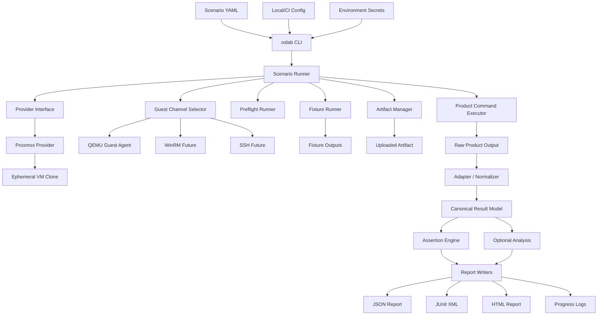

# oslab

언어: [English](README.md) | 한국어

`oslab`은 테스트용 가상 머신(VM)을 자동으로 복제하고, 필요한 환경 준비를 한 뒤, 제품 파일을 올려 실행하고, 결과를 보고서로 정리하는 도구입니다.

조금 더 기술적으로 말하면, `oslab`은 disposable Windows/Linux VM variant 전반에서 software artifact를 검증하기 위한 provider-driven OS integration test platform입니다. YAML scenario를 실제 OS test run으로 바꾸고, 서로 다른 template에서 VM을 clone하고, OS 상태 fixture를 적용하고, artifact upload, command 실행, output 수집, result normalize, assertion 평가, JSON/JUnit/HTML report 생성을 한 흐름으로 처리합니다.

제품별 private workflow는 공개 README 밖에 둡니다. 이 repository의 공개 진입점은 generic demo suite입니다.

## Why It Exists

Unit test나 container test만으로는 모든 OS compatibility 질문에 답하기 어렵습니다. 실제 제품은 여러 OS 버전, patch level, language pack, security setting, runtime state, preinstalled software 조합에서 검증해야 하는 경우가 많습니다.

- 같은 artifact가 Windows 10, Windows 11, Windows Server, 향후 Linux target에서 모두 동작하는가?
- Registry 상태, 설치된 software, policy, user context, network state, runtime prerequisite이 달라도 동작하는가?
- Clean image와 이미 설정이 들어간 image에서 installer 동작이 같은가?
- 최초 등록, 첫 실행 설정, policy refresh 이후 CLI가 정상 실행되는가?
- CI에서 여러 OS/state 조합을 하나의 report format으로 비교할 수 있는가?

`oslab`은 이 matrix를 위한 도구입니다. 제품마다 VM orchestration, guest command execution, artifact transfer, reporting을 다시 만들지 않고도 같은 product validation을 여러 disposable VM template과 fixture-defined OS state 전반에서 반복 실행하게 해줍니다.

## What Each Part Is For

`oslab`의 기능들은 “일을 잘게 나누기 위해” 존재합니다. 그래야 실패했을 때 이것이 VM 문제인지, 환경 준비 문제인지, 제품 실행 문제인지, 결과 해석 문제인지 분리할 수 있습니다.

| Part | 쉬운 설명 | 왜 따로 있나 | 하지 않는 일 |
| --- | --- | --- | --- |
| Scenario | VM, 준비 작업, 실행 작업, 합격 기준을 한 장에 적는 실행 레시피 | 같은 테스트를 여러 OS/template/state에 반복 적용하기 위해 | Secret value를 직접 보관하지 않음 |
| Provider | Proxmox 같은 VM 관리자와 대화하는 계층 | VM 생성/시작/삭제를 제품 테스트와 분리하기 위해 | VM 안에서 제품 command를 실행하지 않음 |
| Guest channel | VM 안에서 명령을 실행하고 파일을 주고받는 통로 | 콘솔 수동 조작 없이 guest 내부 작업을 자동화하기 위해 | 어떤 테스트가 통과인지 판단하지 않음 |
| Fixture | 테스트 전에 VM 안 환경을 준비하는 사전 셋업 | Python 설치, registry 설정, policy 준비처럼 공통 선행조건을 표준화하기 위해 | 제품 실행이나 제품 고유 검증을 담당하지 않음 |
| Artifact | 실제로 시험 볼 대상 파일, 폴더, 설치 파일 | 테스트 대상과 VM/lab 준비를 분리하기 위해 | VM 상태를 준비하는 공통 작업을 담당하지 않음 |
| Artifact command | 업로드된 artifact를 VM 안에서 실행하는 명령 | 제품 실행 실패와 환경 준비 실패를 구분하기 위해 | Report를 직접 만들지 않음 |
| Adapter | 제품마다 다른 raw output을 공통 채점 형식으로 바꾸는 변환기 | 제품 output 형식이 바뀌어도 assertion/report를 안정적으로 유지하기 위해 | Pass/fail 판단을 직접 하지 않음 |
| Assertion | “통과/실패”를 정하는 합격 기준 | 사람이 로그를 읽지 않아도 CI가 판단하게 하기 위해 | Raw output이나 VM을 직접 조작하지 않음 |
| Report | 사람과 CI가 읽는 결과물 | 실패 원인과 증거를 공유하기 위해 | 테스트 실행 자체를 수행하지 않음 |

핵심 경계는 fixture와 artifact입니다. Fixture는 “시험장 준비”이고 artifact는 “시험 볼 대상”입니다. Product 실행을 fixture에 넣으면 환경 준비 실패와 제품 실패가 섞이므로, 제품 실행은 `artifact.command` 또는 `product.steps`에 두는 것이 좋습니다.

## Status

| Area | Current status |
| --- | --- |
| Provider | Proxmox implemented |
| OS path | Windows + QEMU Guest Agent implemented |
| Linux | Scenario model exists, SSH execution not complete yet |
| Artifacts | Folder and installer flows implemented |
| Fixtures | PowerShell fixture execution implemented |
| Results | JSON, JUnit XML, HTML, progress logs implemented |
| Adapters | `canonical.command`, inventory-oriented adapters, 제품별 private adapter는 별도 문서 |
| Providers beyond Proxmox | Planned |

## Public Scope

이 README는 처음 쓰는 사람이 `oslab`을 generic OS/VM integration test platform으로 이해하고 demo를 실행하는 데 필요한 내용을 담습니다. 상세 architecture contract는 [docs/oslab-platform-plan.md](docs/oslab-platform-plan.md)에 있고, 제품별 private workflow는 별도 문서로 분리합니다.

| Area | Public README focus | Detailed docs |
| --- | --- | --- |
| First run | Generic demo suite | [docs/getting-started.ko.md](docs/getting-started.ko.md) |
| Lab setup | Proxmox + Windows template + QGA | [docs/proxmox-connection.ko.md](docs/proxmox-connection.ko.md) |
| Platform contract | Scenario, provider, guest, fixture, artifact, output, report | [docs/oslab-platform-plan.md](docs/oslab-platform-plan.md) |
| Custom adoption | 내 제품 folder/installer를 demo 구조에 연결 | [docs/adoption-guide.ko.md](docs/adoption-guide.ko.md) |

## Documentation

| Need | Start here |
| --- | --- |
| Demo 실행 | [docs/getting-started.ko.md](docs/getting-started.ko.md) |
| 실행할 demo 고르기 | [docs/demos.ko.md](docs/demos.ko.md) |
| 내 제품에 `oslab` 도입 | [docs/adoption-guide.ko.md](docs/adoption-guide.ko.md) |
| 핵심 개념 이해 | [docs/concepts.ko.md](docs/concepts.ko.md) |
| Scenario YAML 작성 | [docs/scenarios.ko.md](docs/scenarios.ko.md) |
| Fixture 작성 | [docs/fixtures.ko.md](docs/fixtures.ko.md) |
| 검증 계층과 JUnit 이해 | [docs/validation.ko.md](docs/validation.ko.md) |
| Proxmox 연결 | [docs/proxmox-connection.ko.md](docs/proxmox-connection.ko.md) |
| Report 확인 | [docs/reports.ko.md](docs/reports.ko.md) |
| Web dashboard 실행 | [docs/web-dashboard.ko.md](docs/web-dashboard.ko.md) |
| Web dashboard 서버 실행/문제 해결 | [docs/web-dashboard-server.ko.md](docs/web-dashboard-server.ko.md) |
| Architecture 이해 | [docs/oslab-platform-plan.md](docs/oslab-platform-plan.md) |
| 공개 release 체크 | [docs/github-release-checklist.md](docs/github-release-checklist.md) |

## Web Dashboard 빠른 실행

자세한 서버 실행/문제 해결 문서는 [docs/web-dashboard-server.ko.md](docs/web-dashboard-server.ko.md)에 있습니다. 로컬에서 바로 켜는 최소 흐름은 다음입니다.

```powershell
corepack pnpm install
Copy-Item apps/api/.env.example apps/api/.env
Copy-Item apps/web/.env.example apps/web/.env
```

최소한 `apps/api/.env`에서 아래 값을 수정합니다.

```text
OSLAB_REPO_ROOT=C:/path/to/oslab
OSLAB_WEB_ADMIN_USERNAME=admin
OSLAB_WEB_ADMIN_PASSWORD=change-me
```

Web app이 다른 API endpoint로 proxy해야 하면 `apps/web/.env`를 수정합니다.

```text
OSLAB_API_PROXY=http://127.0.0.1:3001
```

그 다음 API와 Web UI를 함께 실행합니다.

```powershell
corepack pnpm prisma:generate
corepack pnpm dev
```

브라우저에서 <http://127.0.0.1:3000>을 엽니다. API와 Web을 분리해서 보고 싶을 때는 `corepack pnpm dev:api`, `corepack pnpm dev:web`을 각각 실행합니다.

## Adoption Map

팀이 `oslab`을 도입할 때 가장 먼저 잡아야 하는 것은 ownership입니다. 어떤 파일을 내가 만들고, 어떤 파일이 lab을 설명하고, 어떤 파일을 `oslab`이 생성하는지 구분해야 합니다.

| Piece | Owner | Role | Example |
| --- | --- | --- | --- |
| Template VM | Lab/operator | 특정 OS version/state의 base image | Windows 11 clean image, policy가 켜진 Windows Server |
| Scenario YAML | Test author | Provider, template, fixture, artifact contract, output, assertion, cleanup 선언 | `scenarios/windows/demo-python-hello.local.yaml` |
| Local config | Local/CI environment | Scenario에 넣지 않을 provider default 저장 | `config/oslab.local.yaml` |
| Env file 또는 CI secrets | Local/CI environment | Token secret 같은 민감값 저장 | `config/oslab.local.env` |
| Fixture | Test author/platform team | Artifact 실행 전 guest OS 상태 준비 | Runtime 설치, registry baseline 설정, expected data 생성 |
| Artifact | Product team | 테스트 대상 folder 또는 installer | `validation/artifacts/hello-python` |
| Artifact command | Test author/product team | Upload/install 이후 VM 안에서 실행할 command | `run-python-demo.ps1 -OutputPath ...` |
| Adapter | Platform/product plugin | Raw output을 canonical result로 변환 | `canonical.command`, inventory adapter |
| Assertion | Test author | Normalized output에 대한 pass/fail rule | `command.exitCode`, `command.stdoutContains` |
| Run output | `oslab` | Evidence, logs, normalized data, reports | `runs/<run-id>/` |

Custom product를 붙일 때 보통 필요한 최소 작업은 다음입니다.

1. 테스트할 OS/template/state에 맞는 scenario file을 만든다.
2. 필요한 경우 guest 상태를 준비하는 fixture를 만든다.
3. Folder 또는 installer artifact를 준비한다.
4. `{OutputPath}`에 machine-readable output을 쓰는 command를 만든다.
5. Normalized output을 검증할 assertion을 작성한다.

## Quick Start

아래 흐름은 disposable Windows VM clone에서 의존성이 가장 낮은 PowerShell demo를 먼저 실행하고, 그 다음 Python/C demo를 실행합니다.

### 1. Local Sanity Check, No VM Required

```powershell
uv sync
uv run oslab --help
uv run pytest
uv run oslab validate-scenario --scenario scenarios/windows/demo-powershell-system.example.yaml
uv run oslab validate-scenario --scenario scenarios/windows/demo-python-hello.example.yaml
uv run oslab validate-scenario --scenario scenarios/windows/demo-c-hello.example.yaml
```

이 단계는 Proxmox에 접속하지 않습니다. 실제 lab을 준비하기 전에 먼저 통과해야 합니다. 예상 local unit test 결과:

```text
155 passed
```

### 2. Create Local Config

```powershell
Copy-Item config/oslab.local.example.yaml config/oslab.local.yaml
Copy-Item config/oslab.local.example.env config/oslab.local.env
```

`config/oslab.local.yaml`을 수정합니다.

```yaml
providerDefaults:
  proxmox:
    apiUrl: "https://proxmox.example.local:8006"
    node: "pve01"
    verifyTls: false
    timeoutSeconds: 30
    tokenEnv:
      id: OSLAB_PROXMOX_TOKEN_ID
      secret: OSLAB_PROXMOX_TOKEN_SECRET
```

`config/oslab.local.env`를 수정합니다.

```text
OSLAB_PROXMOX_TOKEN_ID=root@pam!oslab
OSLAB_PROXMOX_TOKEN_SECRET=replace-with-proxmox-token-secret
```

`config/oslab.local.yaml`과 `config/oslab.local.env`는 Git에서 ignore됩니다.

### 3. Create Local Scenario Copies

```powershell
Copy-Item scenarios/windows/demo-powershell-system.example.yaml scenarios/windows/demo-powershell-system.local.yaml
Copy-Item scenarios/windows/demo-python-hello.example.yaml scenarios/windows/demo-python-hello.local.yaml
Copy-Item scenarios/windows/demo-c-hello.example.yaml scenarios/windows/demo-c-hello.local.yaml
```

복사한 `.local.yaml` 파일을 본인 lab에 맞게 수정합니다.

```yaml
provider:
  type: proxmox
  template: windows11-template-qga-9101
  templateVmId: 9101
  vmIdRange:
    start: 9102
    end: 9199
```

Template VM은 stopped 상태여야 하고, Proxmox template으로 변환되어 있어야 하며, QEMU Guest Agent가 설치 및 활성화되어 있어야 합니다.

### 4. Prepare Windows Template VM

현재 완성도가 가장 높은 Windows 실행 경로는 QEMU Guest Agent입니다. Proxmox template으로 변환하기 전에 base Windows VM에서 다음을 준비하세요.

자세한 Proxmox/QGA/WinRM 준비 절차는 [docs/proxmox-connection.ko.md](docs/proxmox-connection.ko.md)의 `Template Requirements`를 참고하세요.

필수:

- Windows 설치 완료
- Proxmox VM Options에서 QEMU Guest Agent enabled
- Windows guest 안에 QEMU Guest Agent installed/running
- PowerShell 사용 가능
- Guest Agent command가 admin-capable context에서 실행 가능
- Demo fixture가 Python/TinyCC를 다운로드해야 한다면 guest internet access

Windows guest에서 관리자 PowerShell로 확인:

```powershell
Get-Service QEMU-GA
Set-Service QEMU-GA -StartupType Automatic
Start-Service QEMU-GA
powershell.exe -NoProfile -ExecutionPolicy Bypass -Command "$PSVersionTable.PSVersion.ToString()"
```

WinRM fallback을 테스트할 계획이라면 추가로 준비합니다. 현재 demo run은 QGA를 사용하므로 필수는 아닙니다.

```powershell
Set-NetConnectionProfile -NetworkCategory Private
Enable-PSRemoting -Force
Get-ChildItem WSMan:\localhost\Listener
```

준비가 끝나면 VM을 shutdown하고 Proxmox에서 template으로 변환한 뒤, scenario의 `provider.templateVmId`에 해당 VMID를 넣습니다.

### 5. Preflight

아래 checks는 VM을 만들지 않습니다.

```powershell
uv run oslab validate-scenario --scenario scenarios/windows/demo-python-hello.local.yaml

uv run oslab preflight `
  --scenario scenarios/windows/demo-python-hello.local.yaml `
  --config config/oslab.local.yaml `
  --env-file config/oslab.local.env `
  --provider-config-check

uv run oslab preflight `
  --scenario scenarios/windows/demo-python-hello.local.yaml `
  --config config/oslab.local.yaml `
  --env-file config/oslab.local.env `
  --provider-connectivity-check

uv run oslab preflight `
  --scenario scenarios/windows/demo-python-hello.local.yaml `
  --config config/oslab.local.yaml `
  --env-file config/oslab.local.env `
  --provider-resource-check
```

정상적인 cleanup 상태:

```text
usedInRange: <none>
```

### 6. Run The PowerShell System Demo

```powershell
uv run oslab run `
  --scenario scenarios/windows/demo-powershell-system.local.yaml `
  --config config/oslab.local.yaml `
  --env-file config/oslab.local.env `
  --artifact-path validation/artifacts/powershell-system `
  --guest-timeout-seconds 300 `
  --command-timeout-seconds 300 `
  --poll-interval-seconds 5
```

예상 결과:

```text
[OK] Run completed
     status: passed
     failureClass: <none>
```

### 7. Run The Python Demo

```powershell
uv run oslab run `
  --scenario scenarios/windows/demo-python-hello.local.yaml `
  --config config/oslab.local.yaml `
  --env-file config/oslab.local.env `
  --artifact-path validation/artifacts/hello-python `
  --guest-timeout-seconds 300 `
  --command-timeout-seconds 300 `
  --poll-interval-seconds 5
```

예상 결과:

```text
[OK] Run completed
     status: passed
     failureClass: <none>
```

Run 결과 확인:

```powershell
uv run oslab inspect-result --run-dir runs\<run-id>
```

예상 command output:

```text
[OK] Command result
stdout: hello from python
```

### Successful Demo Log Example

아래는 실제 Windows Proxmox template에서 Python demo가 통과했을 때의 대표 로그입니다. Timestamp, VMID, run id, byte size는 실행마다 달라집니다.

`runs\<run-id>\logs\progress.log`:

```text
[..] provider.preflight.start - Check Proxmox resources
[OK] provider.preflight.done - Proxmox resource preflight passed
[OK] vm.allocate.done - VMID allocated
[..] vm.clone.start - Create ephemeral VM clone
[OK] vm.clone.done - Ephemeral VM clone created
[..] vm.start.start - Start VM
[OK] vm.boot.done - VM is running
[..] guest.ready.wait - Wait for QEMU Guest Agent
[OK] guest.ready.done - QEMU Guest Agent is ready
[..] preflight.start - Run guest preflight checks
[OK] preflight.done - Guest preflight passed
[..] fixture.start - Apply scenario fixtures
[OK] fixture.done - Fixture applied
    fixtureId: demo-python-runtime
    exitCode: 0
[..] artifact.upload.start - Upload artifact folder
[OK] artifact.upload.done - Artifact folder uploaded
[..] product.command.start - Run product command
[OK] product.command.done - Product command completed
    exitCode: 0
[..] output.collect.start - Collect product output
[OK] output.normalize.done - Product output normalized
[..] assertions.start - Evaluate assertions
[OK] assertions.done - Assertions passed
[OK] vm.destroy.done - VM clone destroyed
[OK] run.done - Run completed
    status: passed
    failureClass: <none>
```

`inspect-result`는 완료된 run을 더 짧게 요약합니다.

```text
== oslab inspect result ==
     scenario: demo.python-hello.windows
[OK] Run passed
     failureClass: <none>
     guestChannel: qemuAgent
     vmDestroyed: True
     assertions: 2 total, 0 failed
     preflight: 6 total, 0 failed
     fixtures: 1 total, 0 failed
[OK] Command result
     command: python hello.py
     exitCode: 0
     stdout: hello from python
     stderr: <empty>
     report:html: runs\<run-id>\reports\result.html
     report:json: runs\<run-id>\reports\result.json
     report:junit: runs\<run-id>\reports\result.junit.xml
     log:progress: runs\<run-id>\logs\progress.log
```

C demo도 같은 흐름으로 통과해야 합니다. 차이는 fixture와 command output입니다.

```text
[OK] fixture.done - Fixture applied
    fixtureId: demo-c-compiler
    exitCode: 0
[OK] Command result
     command: compile and run hello.c
     exitCode: 0
     stdout: hello from c
     stderr: <empty>
```

## Main CLI Commands

전체 command 목록은 다음 명령으로 볼 수 있습니다.

```powershell
uv run oslab --help
```

| Command | When to use it | VM 생성/변경 | Main output |
| --- | --- | --- | --- |
| `validate-scenario` | Lab을 건드리기 전에 YAML shape 확인 | No | Console validation result |
| `preflight` | Config, token, provider connectivity, template, VMID range 확인 | No | Console readiness report |
| `run` | Demo, product smoke, CI에서 사용하는 정상 full scenario 실행 | Yes | `runs/<run-id>/` |
| `suite-run` | 여러 scenario를 선언한 YAML suite를 순차 실행 | Yes | `runs/<suite-run-id>/suite.json` |
| `inspect-result` | 완료된 run을 사람이 읽기 좋게 요약 | No | `run.json`과 normalized files 기반 summary |
| `clone-smoke` | Boot/guest debug 전에 provider clone/destroy만 검증 | Yes | Clone lifecycle status |
| `boot-smoke` | Clone boot와 guest readiness 확인 | Yes | VM boot/QGA readiness status |
| `guest-preflight` | Full artifact 없이 guest readiness checks 실행 | Yes | Guest check results |
| `fixture-smoke` | Fixture upload/execution/output collection debug | Yes | Fixture logs와 expected output files |
| `artifact-smoke` | Full `run` 전에 artifact upload/install/command debug | Yes | Artifact command output과 reports |
| `qga-exec` | Kept VM에서 ad-hoc command 실행 | Existing VM only | Command stdout/stderr |
| `qga-upload` / `qga-download` | Kept VM에 작은 debug file 전송 | Existing VM only | Transferred file |
| `normalize-output` | VM 없이 raw JSON을 adapter로 변환 테스트 | No | Normalized JSON |
| `assert-result` | VM 없이 collected JSON에 scenario assertion 테스트 | No | Assertion summary |
| `analyze-inventory` | VM 없이 canonical inventory 품질/분포 분석 | No | Inventory analysis JSON |

주요 command는 `oslab run`입니다.

```powershell
uv run oslab run `
  --scenario scenarios/windows/demo-python-hello.local.yaml `
  --config config/oslab.local.yaml `
  --env-file config/oslab.local.env `
  --artifact-path validation/artifacts/hello-python
```

`run` 옵션:

| Option | Required | Default | Meaning |
| --- | --- | --- | --- |
| `--scenario <path>` | Yes | none | Provider, guest, fixture, artifact contract, output, assertion, cleanup을 정의하는 scenario YAML |
| `--config <path>` | Recommended | built-in defaults | Local/CI config. 보통 `config/oslab.local.yaml` |
| `--env-file <path>` | Proxmox에서는 권장 | none | Config resolution 전에 ignored `KEY=VALUE` secret을 load. 보통 `config/oslab.local.env` |
| `--artifact-path <path>` | 실제 artifact 실행에는 필요 | none | VM에 upload할 local folder 또는 installer file. 생략하면 `run`은 skeleton result만 작성 |
| `--run-id <id>` | No | auto-generated | Stable run id와 output directory name. CI나 재현 예시에 유용 |
| `--vm-id <id>` | No | `provider.vmIdRange`에서 자동 할당 | Disposable clone VMID를 강제 지정. 충돌을 피해서 신중하게 사용 |
| `--keep-vm` | No | `false` | Debug를 위해 run 이후 clone을 유지. Cleanup은 수동 |
| `--full-clone` | No | `false` | Linked clone 대신 full clone 요청. 느리지만 backing storage state와 더 분리됨 |
| `--boot-timeout-seconds <n>` | No | `300` | Proxmox VM이 running state가 될 때까지 기다리는 최대 시간 |
| `--guest-timeout-seconds <n>` | No | `300` | QEMU Guest Agent 같은 guest channel readiness 최대 대기 시간 |
| `--command-timeout-seconds <n>` | No | `120` | Fixture/product command 최대 실행 시간 |
| `--poll-interval-seconds <n>` | No | `5.0` | VM/guest/command progress polling interval |

Suite file은 `oslab suite-run`으로 실행하며, 동일한 VM timeout/artifact option에 더해 `--max-parallel <n>`을 받을 수 있습니다. 기본값은 `1`이고, VMID range와 Proxmox host 여유가 있을 때만 올리는 것이 좋습니다.

정확한 CLI help는 다음 명령으로 확인합니다.

```powershell
uv run oslab run --help
```

상황별 권장 command 순서:

| Situation | Command flow |
| --- | --- |
| 첫 lab setup | `validate-scenario` -> `preflight --provider-config-check` -> `preflight --provider-connectivity-check` -> `preflight --provider-resource-check` |
| 일반 local demo/product smoke | `run` -> `inspect-result` -> `reports/result.html` 열기 |
| CI gate | `run` -> `runs/**` publish -> `reports/result.junit.xml` 읽기 |
| Fixture debugging | `fixture-smoke --keep-vm` -> `qga-exec` -> manual cleanup/check `usedInRange` |
| Artifact debugging | `artifact-smoke --keep-vm` -> stdout/stderr/raw output 확인 -> full `run` 재실행 |
| Guest/channel debugging | `boot-smoke --keep-vm` -> `qga-exec` -> `qga-upload`/`qga-download` |

전체 검증 계층과 JUnit 구현 상태는 [docs/validation.ko.md](docs/validation.ko.md)를 기준으로 봅니다.

Option tuning guide:

| Symptom | Option to adjust |
| --- | --- |
| Clone boot가 느림 | `--boot-timeout-seconds` |
| QEMU Guest Agent readiness가 늦음 | `--guest-timeout-seconds` |
| Fixture 또는 product command가 오래 걸림 | `--command-timeout-seconds` |
| Proxmox/API polling이 너무 잦거나 느림 | `--poll-interval-seconds` |
| Linked clone 격리가 부족함 | `--full-clone` |
| 실패한 VM을 직접 확인해야 함 | `--keep-vm` |

## How Inputs Become Outputs

Scenario field, file, run output이 서로 연결되는 전체 contract입니다.

| Step | Input | `oslab`이 하는 일 | Output |
| --- | --- | --- | --- |
| 1. Scenario load | `--scenario` YAML | OS/provider/guest/fixture/artifact/assertion config 읽기 | In-memory run plan |
| 2. Provider setup | `config/oslab.local.yaml`, env secrets | Proxmox API 설정과 token resolve | Provider client |
| 3. VM lifecycle | `provider.templateVmId`, `vmIdRange` | Disposable VM clone 생성 및 시작 | Ephemeral VM reference |
| 4. Guest readiness | `guest.mode`, `windowsOrder` | Guest channel 선택/probe | QGA/WinRM/SSH channel |
| 5. Fixture execution | `fixtures[*].source` | Setup script upload/run | Fixture logs, optional expected output |
| 6. Artifact upload | `--artifact-path`, `artifact.destination` | Folder/installer를 guest에 upload | Remote artifact path |
| 7. Artifact command | `artifact.command` 또는 `product.steps` | Token rendering 후 command 실행 | Remote raw output file |
| 8. Output collection | `outputs.actual.path` | Raw output download | `raw/actual-output.json` |
| 9. Normalization | `outputs.actual.adapter` | Raw output을 canonical model로 변환 | `normalized/*.json` |
| 10. Assertions | `assertions` | Pass/fail rule 평가 | Assertion results |
| 11. Reports | `reports.formats` | CI/human/automation report 작성 | `reports/result.*`, `run.json` |
| 12. Cleanup | `cleanup.destroyVm`, `--keep-vm` | Clone 삭제 또는 유지 | Clean VMID range 또는 debug VM |

## Architecture At A Glance

README의 diagram은 전체 platform plan의 요약입니다. 상세 interface, failure taxonomy, phase plan은 [docs/oslab-platform-plan.md](docs/oslab-platform-plan.md)를 기준으로 봅니다.



Core boundaries:

| Layer | Responsibility | Product-specific? |
| --- | --- | --- |
| CLI | Command/options/config/env file path parsing | No |
| Scenario/config resolver | Provider, guest mode, fixtures, artifact, outputs, assertions, cleanup을 run plan으로 해석 | No |
| Provider | VM 생성, 시작, 정지, 삭제 | No |
| Guest channel | VM 내부 command/file interface | No |
| Preflight | Guest가 scenario를 실행할 준비가 되었는지 확인 | No |
| Fixture | Artifact 실행 전 guest OS 상태 준비 | Usually no |
| Artifact manager | 테스트 대상 folder 또는 installer upload/prepare | No |
| Command executor | `artifact.command` 또는 `product.steps` 실행 | No |
| Adapter | Raw output을 canonical result로 변환 | Sometimes |
| Assertion | Normalized output pass/fail 평가 | No |
| Analysis | Canonical result 품질/분포 요약 | No |
| Report writer | CI/human-readable output 생성 | No |

`oslab`은 VM orchestration, guest execution, fixture execution, artifact transfer, output collection, normalization hook, assertion, report를 담당합니다. Product code는 이 repository 밖에 둡니다.

## Core Concepts

| Concept | Meaning |
| --- | --- |
| Scenario | Run을 정의하는 YAML test contract |
| Provider | VM backend, 현재는 Proxmox |
| Guest channel | VM 내부 command/file interface, 현재 Windows QGA가 구현 경로 |
| Fixture | Artifact 실행 전에 guest를 준비하는 setup script |
| Artifact | 테스트 대상 product, script, folder, installer |
| Output | VM 내부에서 생성되고 `oslab`이 수집하는 file |
| Adapter | Raw output을 `canonical.command` 같은 canonical model로 변환 |
| Assertion | Normalized output에 대한 pass/fail rule |
| Report | `runs/<run-id>/reports` 아래 생성되는 JSON/JUnit/HTML 결과 |

## Demo Anatomy

Demo는 제품 전용 지식 없이 platform을 학습할 수 있도록 작게 구성되어 있습니다. 전체 catalog는 [docs/demos.ko.md](docs/demos.ko.md)를 기준으로 봅니다.

| Demo | 배우는 것 | Scenario |
| --- | --- | --- |
| PowerShell system | Runtime bootstrap 없는 최소 command-result 흐름 | `scenarios/windows/demo-powershell-system.example.yaml` |
| Python hello | Runtime fixture와 command assertions | `scenarios/windows/demo-python-hello.example.yaml` |
| C hello | Toolchain fixture와 command assertions | `scenarios/windows/demo-c-hello.example.yaml` |
| Fixture state handoff | Fixture가 VM 상태를 만들고 artifact가 소비하는 흐름 | `scenarios/windows/demo-fixture-state.example.yaml` |
| Agent steps | Ordered `product.steps`, stdout JSON, inventory output | `scenarios/windows/demo-agent-steps.example.yaml` |
| Python unittest | VM 내부 실제 unit test 실행 | `scenarios/windows/demo-python-unittest.example.yaml` |
| Python HTTP service | VM 내부 service lifecycle과 HTTP smoke 검증 | `scenarios/windows/demo-python-http-service.example.yaml` |
| C unit test | Multi-file compile/link/run unit test | `scenarios/windows/demo-c-unit.example.yaml` |
| Intentional assertion failure | Assertion failure가 HTML/JUnit/JSON에 표시되는 방식 | `scenarios/windows/demo-intentional-assertion-failure.example.yaml` |

### Python Demo

```text
scenarios/windows/demo-python-hello.example.yaml
validation/fixtures/windows/demo-python-runtime.ps1
validation/artifacts/hello-python/
  hello.py
  run-python-demo.ps1
```

실행 흐름:

1. Scenario가 disposable Windows clone을 생성합니다.
2. `demo-python-runtime.ps1` fixture가 실행됩니다.
3. Fixture는 guest에 `python.exe` 또는 `py.exe`가 있으면 재사용합니다.
4. Python이 없으면 `C:\Oslab\tools\python`에 portable Python을 bootstrap합니다.
5. Fixture는 `C:\Oslab\demo-python-runtime.json`을 남깁니다.
6. `validation/artifacts/hello-python`이 `C:\Oslab\artifact`로 upload됩니다.
7. `run-python-demo.ps1`가 `{ArtifactDir}`에서 실행됩니다.
8. Script는 `C:\Oslab\command-result.json`을 씁니다.
9. `oslab`이 file을 수집하고, `canonical.command`로 normalize하고, exit code/stdout assertion을 확인하고, report를 생성합니다.

### C Demo

```text
scenarios/windows/demo-c-hello.example.yaml
validation/fixtures/windows/demo-c-compiler.ps1
validation/artifacts/hello-c/
  hello.c
  run-c-demo.ps1
```

실행 흐름:

1. Scenario가 disposable Windows clone을 생성합니다.
2. `demo-c-compiler.ps1` fixture가 실행됩니다.
3. Fixture는 `cl.exe`, `gcc.exe`, `clang.exe`가 있으면 재사용합니다.
4. Compiler가 없으면 `C:\Oslab\tools\tcc`에 TinyCC를 bootstrap합니다.
5. Fixture는 `C:\Oslab\demo-c-compiler.json`을 남깁니다.
6. `validation/artifacts/hello-c`가 `C:\Oslab\artifact`로 upload됩니다.
7. `run-c-demo.ps1`가 `hello.c`를 compile/run합니다.
8. Script는 `C:\Oslab\command-result.json`을 씁니다.
9. `oslab`이 normalize, assertion, report, clone destroy를 수행합니다.

Guest VM에서 internet 접근이 안 된다면 Python/TinyCC를 template에 미리 설치하거나 fixture가 내부 package source를 사용하도록 바꾸세요.

## Scenario Anatomy

Python demo scenario의 형태입니다.

```yaml
schemaVersion: 1
id: demo.python-hello.windows
name: Generic Python hello world Windows demo
os:
  family: windows
  version: "11"
provider:
  type: proxmox
  template: windows11-template-qga-9101
  templateVmId: 9101
  vmIdRange:
    start: 9102
    end: 9199
isolation:
  mode: ephemeralClone
guest:
  mode: auto
  windowsOrder:
    - qemuAgent
    - winrm
fixtures:
  - id: demo-python-runtime
    type: powershell
    source: validation/fixtures/windows/demo-python-runtime.ps1
    expectedOutput: "C:\\Oslab\\demo-python-runtime.json"
artifact:
  type: folder
  pathParam: artifactPath
  destination: "C:\\Oslab\\artifact"
  transfer: archive
  command:
    shell: powershell
    template: '& "{ArtifactDir}\run-python-demo.ps1" -OutputPath "{OutputPath}"'
outputs:
  actual:
    path: "C:\\Oslab\\command-result.json"
    adapter: canonical.command
assertions:
  - type: command.exitCode
    id: python-exit-zero
    exitCode: 0
  - type: command.stdoutContains
    id: python-stdout-hello
    text: hello from python
reports:
  formats:
    - junit
    - json
    - html
cleanup:
  destroyVm: true
  keepVmOnFailure: false
```

중요한 field:

| Field | Why it matters |
| --- | --- |
| `provider.templateVmId` | Disposable clone의 원본 template |
| `provider.vmIdRange` | Temporary validation VM에 예약된 range |
| `isolation.mode` | `ephemeralClone`이면 매 run마다 fresh clone 사용 |
| `guest.mode` | `auto`는 사용 가능한 guest channel을 선택 |
| `fixtures` | Artifact upload/execution 전 setup 실행 |
| `artifact.pathParam` | CLI `--artifact-path`와 scenario 연결 |
| `artifact.destination` | Artifact가 놓일 guest 내부 directory |
| `artifact.command.template` | `{ArtifactDir}`, `{OutputPath}` 같은 token으로 렌더링되는 guest command |
| `outputs.actual.path` | Command 실행 후 수집할 remote file |
| `outputs.actual.adapter` | Raw output을 canonical result로 변환 |
| `assertions` | Pass/fail 조건 |
| `reports.formats` | JUnit, JSON, HTML output 선택 |
| `cleanup.destroyVm` | Run 종료 후 clone 삭제 |

## Artifact Contracts

### Folder Artifact

Folder artifact는 테스트 대상이 script, binary, support file 묶음일 때 사용합니다.

```yaml
artifact:
  type: folder
  pathParam: artifactPath
  destination: "C:\\Oslab\\artifact"
  transfer: archive
  command:
    shell: powershell
    template: '& "{ArtifactDir}\run-python-demo.ps1" -OutputPath "{OutputPath}"'
```

| Token | Meaning |
| --- | --- |
| `{ArtifactDir}` | Artifact folder가 guest에 extract된 remote directory |
| `{OutputPath}` | `outputs.actual.path`에서 온 remote output file path |

Artifact command는 `{OutputPath}`에 machine-readable result를 써야 합니다.

`canonical.command` output 예시:

```json
{
  "schemaVersion": 1,
  "kind": "commandResult",
  "command": "python hello.py",
  "exitCode": 0,
  "stdout": "hello from python\r\n",
  "stderr": "",
  "metadata": {}
}
```

### Installer Artifact

Installer artifact는 product command 실행 전에 설치가 필요한 경우 사용합니다.

```yaml
artifact:
  type: installer
  pathParam: artifactPath
  destination: "C:\\Oslab\\installer"
  installCommand:
    shell: powershell
    template: '& "{InstallerPath}" -InstallDir "C:\\Oslab\\installed"'
  command:
    shell: powershell
    template: '& "C:\\Oslab\\installed\\run-product.ps1" -OutputPath "{OutputPath}"'
```

| Token | Meaning |
| --- | --- |
| `{InstallerPath}` | Uploaded installer file의 remote path |
| `{OutputPath}` | `outputs.actual.path`에서 온 remote output file path |

Installer 실패는 JUnit에서 `artifact.install` error로 기록됩니다.

## Reports And Run Output

Full run은 안정적인 output layout을 생성합니다.

```text
runs/<run-id>/
  run.json
  logs/
    progress.log
    progress.jsonl
    product.stdout.log
    product.stderr.log
  raw/
    actual-output.json
    fixture-<fixture-id>.expected-output.json
  normalized/
    command-result.json
  reports/
    result.json
    result.junit.xml
    result.html
```

실행 중 progress 확인:

```powershell
Get-Content runs\<run-id>\logs\progress.log -Wait
```

완료된 run 확인:

```powershell
uv run oslab inspect-result --run-dir runs\<run-id>
Invoke-Item runs\<run-id>\reports\result.html
```

CI에서는 `runs/**`를 artifact로 publish하고 test reporter가 다음 파일을 읽게 하면 됩니다.

```text
runs/<run-id>/reports/result.junit.xml
```

File roles:

| File or directory | Primary reader | Role |
| --- | --- | --- |
| `run.json` | `inspect-result`, automation | Run summary, status, failure class, path index |
| `logs/progress.log` | Human | 읽기 쉬운 live progress와 failure triage |
| `logs/progress.jsonl` | Automation/dashboard | Structured event stream |
| `logs/product*.stdout.log` / `stderr.log` | Human/debugger | Guest command raw logs |
| `raw/actual-output.json` | Adapter/debugger | Guest에서 수집한 raw file |
| `raw/product-steps.json` | Step-based product debugger | Step별 command result evidence |
| `normalized/command-result.json` | Assertions/human/debugger | Canonical command result |
| `normalized/inventory.json` | Assertions/analysis | Canonical inventory result |
| `reports/result.junit.xml` | CI test reporter | Gate/pass-fail integration |
| `reports/result.json` | Automation | Machine-readable report |
| `reports/result.html` | Human reviewer | Static readable report |

Failure classes:

`oslab`은 실패를 하나의 generic failure로 뭉치지 않고 어느 단계에서 막혔는지 분리합니다. 이 값은 `run.json`, JSON/HTML report, `inspect-result`에서 확인합니다.

| Failure class | Meaning |
| --- | --- |
| `provider_failure` | Provider config/API/auth/setup 문제 |
| `vm_clone_failure` | VM clone 생성 실패 또는 timeout |
| `guest_ready_timeout` | VM은 켜졌지만 guest readiness timeout |
| `guest_channel_failure` | 사용 가능한 command/file channel 없음 |
| `preflight_failure` | OS baseline이 scenario 실행 조건을 만족하지 않음 |
| `fixture_failure` | VM 환경 준비 script 실패 |
| `artifact_failure` | Artifact upload/install/prepare 실패 |
| `product_execution_failure` | Product/demo command 또는 step 실패 |
| `plugin_failure` | Adapter/plugin 실행 또는 output protocol 실패 |
| `assertion_failure` | Normalized output이 assertion을 만족하지 않음 |
| `report_failure` | Report 작성 실패 |
| `cleanup_failure` | VM cleanup 실패 |

JUnit mapping:

| Testcase | Meaning | Failure type |
| --- | --- | --- |
| `preflight.<check-id>` | Guest readiness | `error` |
| `fixture.<fixture-id>` | Fixture/bootstrap | `error` |
| `artifact.install` | Installer execution | `error` |
| `product.command` | Product/demo command execution | `error` |
| `product.step.<step-id>` | Ordered product step | `error` |
| `assertion.<assertion-id>` | Output assertion mismatch | `failure` |

## Repository Layout

```text
config/                     Local config examples
docs/                       Architecture, Proxmox, scenario, report docs
scenarios/windows/          Example Windows scenarios
scenarios/linux/            Linux schema/design examples
src/oslab/                  CLI and platform code
tests/                      Unit and fake-provider tests
validation/artifacts/       Demo artifacts uploaded into VMs
validation/fixtures/        Guest setup/bootstrap scripts
validation/expected/        Expected data for fixture/scenario checks
validation/raw/             Local adapter/assertion test용 raw sample data
```

생성된 run 결과는 `runs/`에 저장되며 Git에서 ignore됩니다.

## Useful Commands

C demo 실행:

```powershell
uv run oslab run `
  --scenario scenarios/windows/demo-c-hello.local.yaml `
  --config config/oslab.local.yaml `
  --env-file config/oslab.local.env `
  --artifact-path validation/artifacts/hello-c `
  --guest-timeout-seconds 300 `
  --command-timeout-seconds 300 `
  --poll-interval-seconds 5
```

Fake folder artifact smoke 실행:

```powershell
uv run oslab artifact-smoke `
  --scenario scenarios/windows/fake-artifact-smoke.example.yaml `
  --config config/oslab.local.yaml `
  --env-file config/oslab.local.env `
  --artifact-path validation/artifacts/fake-scanner
```

Debug를 위해 VM 유지:

```powershell
uv run oslab boot-smoke `
  --scenario scenarios/windows/demo-python-hello.local.yaml `
  --config config/oslab.local.yaml `
  --env-file config/oslab.local.env `
  --keep-vm
```

Kept VM에서 QEMU Guest Agent로 command 실행:

```powershell
uv run oslab qga-exec `
  --config config/oslab.local.yaml `
  --env-file config/oslab.local.env `
  --vm-id 9102 `
  --timeout-seconds 30 `
  -- powershell.exe -NoProfile -Command whoami
```

Cleanup 확인:

```powershell
uv run oslab preflight `
  --scenario scenarios/windows/demo-python-hello.local.yaml `
  --config config/oslab.local.yaml `
  --env-file config/oslab.local.env `
  --provider-resource-check
```

## Security And Limits

- 실제 config는 `config/oslab.local.yaml`에 둡니다.
- 실제 secret은 `config/oslab.local.env` 또는 CI secret storage에 둡니다.
- API token, lab IP, product credential, run artifact를 commit하지 마세요.
- Command template은 `secretTokens`를 통해 secret을 렌더링할 수 있으며, report와 console output은 해당 값을 redaction해야 합니다.
- Validation node, template, storage, VMID range에 scope가 제한된 Proxmox API token을 권장합니다.
- 현재 가장 완성된 경로는 Windows + Proxmox + QEMU Guest Agent입니다.
- Linux SSH execution, non-Proxmox provider, stale VM cleanup metadata, provider diagnostics 보강은 planned 상태입니다.

## Project Boundary

Core platform은 product-neutral이어야 합니다.

Product-specific behavior는 다음 위치에 둡니다.

- scenarios
- fixtures
- artifacts
- plugin adapters
- 공개 onboarding 경로 밖의 product-owned documentation

Product code 자체는 이 repository 밖에 둡니다.
