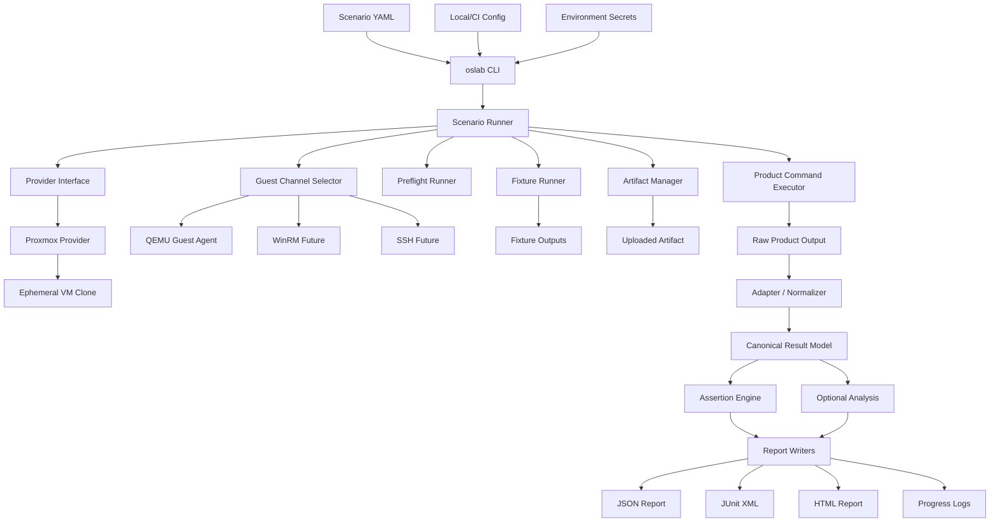

# oslab

Language: English | [한국어](README.ko.md)

`oslab` automatically clones a test virtual machine (VM), prepares the guest environment, uploads a product artifact, runs it, and writes reports.

More technically, `oslab` is a provider-driven OS integration test platform for validating software artifacts across disposable Windows and Linux VM variants. It turns YAML scenarios into real OS test runs: clone VMs from different templates, apply OS-state fixtures, upload artifacts, execute commands, collect outputs, normalize results, evaluate assertions, and write JSON/JUnit/HTML reports.

Product-specific workflows are intentionally kept outside the public README. The public entry point for this repository is the generic demo suite.

## Why It Exists

Unit tests and container tests do not answer every OS compatibility question. Real products often need to be checked across several OS versions, patch levels, language packs, security settings, runtime states, and preinstalled software combinations.

- Does the same artifact work on Windows 10, Windows 11, Windows Server, and future Linux targets?
- Does it still work when the VM has different registry state, installed software, policies, user context, network state, or runtime prerequisites?
- Does the installer behave the same on a clean image and a previously configured image?
- Does the CLI run after registration, first-time setup, or policy refresh?
- Can CI compare those OS/state combinations with one report format?

`oslab` exists for that matrix. It gives product teams a repeatable way to run the same product validation across many disposable VM templates and fixture-defined OS states without rebuilding VM orchestration, guest command execution, artifact transfer, and reporting for every project.

## What Each Part Is For

`oslab` splits the run into layers so failures are easier to classify. A failed run should make it clear whether the problem is VM lifecycle, guest readiness, environment setup, product execution, output parsing, or assertions.

| Part | Plain meaning | Why it exists separately | Does not own |
| --- | --- | --- | --- |
| Scenario | A run recipe that lists the VM, setup, command, output, and pass/fail rules | Reuse one test shape across OS templates and states | Secret values |
| Provider | The layer that talks to Proxmox or another VM backend | Keep VM lifecycle separate from product testing | Guest product commands |
| Guest channel | The way `oslab` runs commands and transfers files inside the VM | Automate guest work without manual console use | Pass/fail decisions |
| Fixture | Pre-test environment setup inside the VM | Standardize shared prerequisites such as runtimes, registry state, or policy | Product execution |
| Artifact | The thing being tested: folder, binary set, or installer | Keep the product under test separate from lab setup | Shared guest preparation |
| Artifact command | The command that runs the uploaded artifact in the VM | Separate product failures from setup failures | Report generation |
| Adapter | Translator from raw product output to a common scoring model | Absorb product output shape differences | Pass/fail decisions |
| Assertion | Pass/fail rule over normalized output | Let CI decide without a human reading logs | Raw VM manipulation |
| Report | Output for humans, CI, and automation | Share result and evidence consistently | Test execution |

The most important boundary is fixture vs artifact. A fixture prepares the test room; the artifact is what takes the test. Product execution should live in `artifact.command` or `product.steps`, not in fixtures, so setup failures and product failures stay separate.

## Status

| Area | Current status |
| --- | --- |
| Provider | Proxmox implemented |
| OS path | Windows + QEMU Guest Agent implemented |
| Linux | Scenario model exists, SSH execution not complete yet |
| Artifacts | Folder and installer flows implemented |
| Fixtures | PowerShell fixture execution implemented |
| Results | JSON, JUnit XML, HTML, progress logs implemented |
| Adapters | `canonical.command`, inventory-oriented adapters, private product adapters documented separately |
| Providers beyond Proxmox | Planned |

## Public Scope

This README helps a new user understand `oslab` as a generic OS/VM integration test platform and run the public demos. The detailed architecture contract lives in [docs/oslab-platform-plan.md](docs/oslab-platform-plan.md), and product-specific private workflows are documented separately.

| Area | Public README focus | Detailed docs |
| --- | --- | --- |
| First run | Generic demo suite | [docs/getting-started.md](docs/getting-started.md) |
| Lab setup | Proxmox + Windows template + QGA | [docs/proxmox-connection.md](docs/proxmox-connection.md) |
| Platform contract | Scenario, provider, guest, fixture, artifact, output, report | [docs/oslab-platform-plan.md](docs/oslab-platform-plan.md) |
| Custom adoption | Connect your own folder/installer to the demo structure | [docs/adoption-guide.md](docs/adoption-guide.md) |

## Documentation

| Need | Start here |
| --- | --- |
| Run the demos | [docs/getting-started.md](docs/getting-started.md) |
| Choose a demo | [docs/demos.md](docs/demos.md) |
| Adopt `oslab` for your product | [docs/adoption-guide.md](docs/adoption-guide.md) |
| Understand the concepts | [docs/concepts.md](docs/concepts.md) |
| Write scenario YAML | [docs/scenarios.md](docs/scenarios.md) |
| Write fixtures | [docs/fixtures.md](docs/fixtures.md) |
| Understand validation and JUnit | [docs/validation.md](docs/validation.md) |
| Connect Proxmox | [docs/proxmox-connection.md](docs/proxmox-connection.md) |
| Inspect reports | [docs/reports.md](docs/reports.md) |
| Understand architecture | [docs/oslab-platform-plan.md](docs/oslab-platform-plan.md) |
| Check public release readiness | [docs/github-release-checklist.md](docs/github-release-checklist.md) |

## Adoption Map

When a team adopts `oslab`, the first useful mental model is ownership: which files you create, which files describe the lab, and which files `oslab` creates after a run.

| Piece | Who owns it | Role | Example |
| --- | --- | --- | --- |
| Template VM | Lab/operator | Base OS image for one OS version/state | Windows 11 clean image, Windows Server with policy enabled |
| Scenario YAML | Test author | Declares provider, template, fixtures, artifact contract, output, assertions, cleanup | `scenarios/windows/demo-python-hello.local.yaml` |
| Local config | Local/CI environment | Stores provider defaults that should not live in scenarios | `config/oslab.local.yaml` |
| Env file or CI secrets | Local/CI environment | Stores token secrets and other sensitive values | `config/oslab.local.env` |
| Fixture | Test author/platform team | Prepares guest OS state before the artifact runs | Install runtime, set registry baseline, create expected data |
| Artifact | Product team | Folder or installer being tested | `validation/artifacts/hello-python` |
| Artifact command | Test author/product team | Command run inside the VM after upload/install | `run-python-demo.ps1 -OutputPath ...` |
| Adapter | Platform/product plugin | Converts raw output into a canonical result | `canonical.command`, inventory adapter |
| Assertion | Test author | Pass/fail rules over normalized output | `command.exitCode`, `command.stdoutContains` |
| Run output | `oslab` | Evidence, logs, normalized data, reports | `runs/<run-id>/` |

Minimal custom product adoption usually means creating or copying:

1. A scenario file for the OS/template/state you want to test.
2. Optional fixtures that prepare the guest state.
3. A folder or installer artifact.
4. A command that writes machine-readable output to `{OutputPath}`.
5. Assertions that validate the normalized output.

## Quick Start

This path runs the lowest-dependency PowerShell demo first, then the Python/C demos in disposable Windows VM clones.

### 1. Local Sanity Check, No VM Required

```powershell
uv sync
uv run oslab --help
uv run pytest
uv run oslab validate-scenario --scenario scenarios/windows/demo-powershell-system.example.yaml
uv run oslab validate-scenario --scenario scenarios/windows/demo-python-hello.example.yaml
uv run oslab validate-scenario --scenario scenarios/windows/demo-c-hello.example.yaml
```

This step does not contact Proxmox and should pass before you prepare a real lab. Expected local unit test result:

```text
137 passed
```

### 2. Create Local Config

```powershell
Copy-Item config/oslab.local.example.yaml config/oslab.local.yaml
Copy-Item config/oslab.local.example.env config/oslab.local.env
```

Edit `config/oslab.local.yaml`:

```yaml
providerDefaults:
  proxmox:
    apiUrl: "https://proxmox.example.local:8006"
    node: "pve01"
    verifyTls: false
    timeoutSeconds: 30
    tokenEnv:
      id: OSLAB_PROXMOX_TOKEN_ID
      secret: OSLAB_PROXMOX_TOKEN_SECRET
```

Edit `config/oslab.local.env`:

```text
OSLAB_PROXMOX_TOKEN_ID=root@pam!oslab
OSLAB_PROXMOX_TOKEN_SECRET=replace-with-proxmox-token-secret
```

`config/oslab.local.yaml` and `config/oslab.local.env` are ignored by Git.

### 3. Create Local Scenario Copies

```powershell
Copy-Item scenarios/windows/demo-powershell-system.example.yaml scenarios/windows/demo-powershell-system.local.yaml
Copy-Item scenarios/windows/demo-python-hello.example.yaml scenarios/windows/demo-python-hello.local.yaml
Copy-Item scenarios/windows/demo-c-hello.example.yaml scenarios/windows/demo-c-hello.local.yaml
```

Edit the copied `.local.yaml` files for your lab:

```yaml
provider:
  type: proxmox
  template: windows11-template-qga-9101
  templateVmId: 9101
  vmIdRange:
    start: 9102
    end: 9199
```

The template VM must be stopped, converted to a Proxmox template, and configured with QEMU Guest Agent.

### 4. Prepare Windows Template VM

The most complete Windows execution path currently uses QEMU Guest Agent. Before converting the base VM into a Proxmox template, prepare the Windows guest.

For detailed Proxmox/QGA/WinRM setup steps, see `Template Requirements` in [docs/proxmox-connection.md](docs/proxmox-connection.md).

Required:

- Windows is installed and bootable.
- QEMU Guest Agent is enabled in Proxmox VM Options.
- QEMU Guest Agent is installed and running inside Windows.
- PowerShell is available.
- Guest Agent commands run in an admin-capable context.
- The guest can reach the internet if demo fixtures must download Python/TinyCC.

Verify inside the Windows guest with Administrator PowerShell:

```powershell
Get-Service QEMU-GA
Set-Service QEMU-GA -StartupType Automatic
Start-Service QEMU-GA
powershell.exe -NoProfile -ExecutionPolicy Bypass -Command "$PSVersionTable.PSVersion.ToString()"
```

If you plan to test WinRM fallback, also prepare PowerShell remoting. Current demo runs use QGA, so this is optional for now.

```powershell
Set-NetConnectionProfile -NetworkCategory Private
Enable-PSRemoting -Force
Get-ChildItem WSMan:\localhost\Listener
```

After preparation, shut down the VM, convert it to a Proxmox template, and set `provider.templateVmId` in the scenario.

### 5. Preflight

These checks do not create a VM:

```powershell
uv run oslab validate-scenario --scenario scenarios/windows/demo-python-hello.local.yaml

uv run oslab preflight `
  --scenario scenarios/windows/demo-python-hello.local.yaml `
  --config config/oslab.local.yaml `
  --env-file config/oslab.local.env `
  --provider-config-check

uv run oslab preflight `
  --scenario scenarios/windows/demo-python-hello.local.yaml `
  --config config/oslab.local.yaml `
  --env-file config/oslab.local.env `
  --provider-connectivity-check

uv run oslab preflight `
  --scenario scenarios/windows/demo-python-hello.local.yaml `
  --config config/oslab.local.yaml `
  --env-file config/oslab.local.env `
  --provider-resource-check
```

Healthy cleanup state:

```text
usedInRange: <none>
```

### 6. Run The PowerShell System Demo

```powershell
uv run oslab run `
  --scenario scenarios/windows/demo-powershell-system.local.yaml `
  --config config/oslab.local.yaml `
  --env-file config/oslab.local.env `
  --artifact-path validation/artifacts/powershell-system `
  --guest-timeout-seconds 300 `
  --command-timeout-seconds 300 `
  --poll-interval-seconds 5
```

Expected result:

```text
[OK] Run completed
     status: passed
     failureClass: <none>
```

### 7. Run The Python Demo

```powershell
uv run oslab run `
  --scenario scenarios/windows/demo-python-hello.local.yaml `
  --config config/oslab.local.yaml `
  --env-file config/oslab.local.env `
  --artifact-path validation/artifacts/hello-python `
  --guest-timeout-seconds 300 `
  --command-timeout-seconds 300 `
  --poll-interval-seconds 5
```

Expected result:

```text
[OK] Run completed
     status: passed
     failureClass: <none>
```

Inspect the run:

```powershell
uv run oslab inspect-result --run-dir runs\<run-id>
```

Expected command output:

```text
[OK] Command result
stdout: hello from python
```

### Successful Demo Log Example

The snippet below shows a passing Python demo run against a real Windows Proxmox template. Timestamps, VMIDs, run ids, and byte counts vary between runs.

`runs\<run-id>\logs\progress.log`:

```text
[..] provider.preflight.start - Check Proxmox resources
[OK] provider.preflight.done - Proxmox resource preflight passed
[OK] vm.allocate.done - VMID allocated
[..] vm.clone.start - Create ephemeral VM clone
[OK] vm.clone.done - Ephemeral VM clone created
[..] vm.start.start - Start VM
[OK] vm.boot.done - VM is running
[..] guest.ready.wait - Wait for QEMU Guest Agent
[OK] guest.ready.done - QEMU Guest Agent is ready
[..] preflight.start - Run guest preflight checks
[OK] preflight.done - Guest preflight passed
[..] fixture.start - Apply scenario fixtures
[OK] fixture.done - Fixture applied
    fixtureId: demo-python-runtime
    exitCode: 0
[..] artifact.upload.start - Upload artifact folder
[OK] artifact.upload.done - Artifact folder uploaded
[..] product.command.start - Run product command
[OK] product.command.done - Product command completed
    exitCode: 0
[..] output.collect.start - Collect product output
[OK] output.normalize.done - Product output normalized
[..] assertions.start - Evaluate assertions
[OK] assertions.done - Assertions passed
[OK] vm.destroy.done - VM clone destroyed
[OK] run.done - Run completed
    status: passed
    failureClass: <none>
```

`inspect-result` gives a shorter human-readable summary of the completed run.

```text
== oslab inspect result ==
     scenario: demo.python-hello.windows
[OK] Run passed
     failureClass: <none>
     guestChannel: qemuAgent
     vmDestroyed: True
     assertions: 2 total, 0 failed
     preflight: 6 total, 0 failed
     fixtures: 1 total, 0 failed
[OK] Command result
     command: python hello.py
     exitCode: 0
     stdout: hello from python
     stderr: <empty>
     report:html: runs\<run-id>\reports\result.html
     report:json: runs\<run-id>\reports\result.json
     report:junit: runs\<run-id>\reports\result.junit.xml
     log:progress: runs\<run-id>\logs\progress.log
```

The C demo should pass through the same lifecycle. The key differences are the fixture and command output.

```text
[OK] fixture.done - Fixture applied
    fixtureId: demo-c-compiler
    exitCode: 0
[OK] Command result
     command: compile and run hello.c
     exitCode: 0
     stdout: hello from c
     stderr: <empty>
```

## Main CLI Commands

Use `uv run oslab --help` to see every command.

| Command | When to use it | Creates/changes VM? | Main output |
| --- | --- | --- | --- |
| `validate-scenario` | Check YAML shape before touching lab infrastructure | No | Console validation result |
| `preflight` | Check config, token, provider connectivity, template, VMID range | No | Console readiness report |
| `run` | Normal full scenario execution for demos, product smoke tests, and CI | Yes | `runs/<run-id>/` |
| `inspect-result` | Summarize a completed run for humans | No | Console summary from `run.json` and normalized files |
| `clone-smoke` | Prove provider clone/destroy works before boot/guest debugging | Yes | Clone lifecycle status |
| `boot-smoke` | Prove clone boot and guest readiness work | Yes | VM boot/QGA readiness status |
| `guest-preflight` | Run guest readiness checks without full artifact execution | Yes | Guest check results |
| `fixture-smoke` | Debug fixture upload/execution/output collection | Yes | Fixture logs and expected output files |
| `artifact-smoke` | Debug artifact upload/install/command before full `run` integration | Yes | Artifact command output and reports |
| `qga-exec` | Run an ad-hoc command in a kept VM | Existing VM only | Command stdout/stderr |
| `qga-upload` / `qga-download` | Move small debug files in/out of a kept VM | Existing VM only | Transferred file |
| `normalize-output` | Test an adapter against a raw JSON file without a VM | No | Normalized JSON |
| `assert-result` | Test scenario assertions against a collected JSON file without a VM | No | Assertion summary |
| `analyze-inventory` | Analyze canonical inventory quality/distribution without a VM | No | Inventory analysis JSON |

The main command is `oslab run`:

```powershell
uv run oslab run `
  --scenario scenarios/windows/demo-python-hello.local.yaml `
  --config config/oslab.local.yaml `
  --env-file config/oslab.local.env `
  --artifact-path validation/artifacts/hello-python
```

Run-specific options:

| Option | Required | Default | Meaning |
| --- | --- | --- | --- |
| `--scenario <path>` | Yes | none | Scenario YAML that defines provider, guest, fixtures, artifact contract, outputs, assertions, and cleanup. |
| `--config <path>` | Recommended | built-in defaults | Local/CI config. Usually `config/oslab.local.yaml`. |
| `--env-file <path>` | Recommended for Proxmox | none | Loads ignored `KEY=VALUE` secrets before config resolution. Usually `config/oslab.local.env`. |
| `--artifact-path <path>` | Required for real artifact execution | none | Local folder or installer file uploaded into the VM. If omitted, `run` only writes a skeleton result. |
| `--run-id <id>` | No | auto-generated | Stable run id and output directory name. Useful for CI or reproducible examples. |
| `--vm-id <id>` | No | allocated from `provider.vmIdRange` | Forces a specific disposable clone VMID. Use carefully to avoid collisions. |
| `--keep-vm` | No | `false` | Keeps the clone after the run for debugging. Cleanup becomes manual. |
| `--full-clone` | No | `false` | Requests a full clone instead of a linked clone. Slower, but more isolated from backing storage state. |
| `--boot-timeout-seconds <n>` | No | `300` | Maximum time to wait for the Proxmox VM to reach running state. |
| `--guest-timeout-seconds <n>` | No | `300` | Maximum time to wait for guest channel readiness, such as QEMU Guest Agent. |
| `--command-timeout-seconds <n>` | No | `120` | Maximum time for fixture/product commands unless overridden by scenario behavior. |
| `--poll-interval-seconds <n>` | No | `5.0` | Poll interval for VM/guest/command progress checks. |

For exact CLI help:

```powershell
uv run oslab run --help
```

Recommended command order by situation:

| Situation | Command flow |
| --- | --- |
| First lab setup | `validate-scenario` -> `preflight --provider-config-check` -> `preflight --provider-connectivity-check` -> `preflight --provider-resource-check` |
| Normal local demo/product smoke | `run` -> `inspect-result` -> open `reports/result.html` |
| CI gate | `run` -> publish `runs/**` -> read `reports/result.junit.xml` |
| Fixture debugging | `fixture-smoke --keep-vm` -> `qga-exec` -> manual cleanup/check `usedInRange` |
| Artifact debugging | `artifact-smoke --keep-vm` -> inspect stdout/stderr/raw output -> rerun full `run` |
| Guest/channel debugging | `boot-smoke --keep-vm` -> `qga-exec` -> `qga-upload`/`qga-download` |

For the full validation ladder and JUnit status, see [docs/validation.md](docs/validation.md).

Option tuning guide:

| Symptom | Option to adjust |
| --- | --- |
| Clone boots slowly | `--boot-timeout-seconds` |
| QEMU Guest Agent becomes ready slowly | `--guest-timeout-seconds` |
| Fixture or product command needs more time | `--command-timeout-seconds` |
| Proxmox/API polling is too noisy or too slow | `--poll-interval-seconds` |
| Linked clone behavior is not isolated enough | `--full-clone` |
| You need to inspect a failed VM manually | `--keep-vm` |

## How Inputs Become Outputs

This is the end-to-end contract that connects scenario fields, files, and run output.

| Step | Input | What `oslab` does | Output |
| --- | --- | --- | --- |
| 1. Scenario load | `--scenario` YAML | Reads OS/provider/guest/fixture/artifact/assertion config | In-memory run plan |
| 2. Provider setup | `config/oslab.local.yaml`, env secrets | Resolves Proxmox API settings and token | Provider client |
| 3. VM lifecycle | `provider.templateVmId`, `vmIdRange` | Clones and starts a disposable VM | Ephemeral VM reference |
| 4. Guest readiness | `guest.mode`, `windowsOrder` | Selects/probes guest channel | QGA/WinRM/SSH channel |
| 5. Fixture execution | `fixtures[*].source` | Uploads and runs setup scripts | Fixture logs and optional expected output |
| 6. Artifact upload | `--artifact-path`, `artifact.destination` | Uploads folder/installer into guest | Remote artifact path |
| 7. Artifact command | `artifact.command` or `product.steps` | Renders tokens and executes command(s) | Remote raw output file |
| 8. Output collection | `outputs.actual.path` | Downloads the raw output | `raw/actual-output.json` |
| 9. Normalization | `outputs.actual.adapter` | Converts raw output to canonical model | `normalized/*.json` |
| 10. Assertions | `assertions` | Evaluates pass/fail rules | Assertion results |
| 11. Reports | `reports.formats` | Writes CI/human/automation reports | `reports/result.*`, `run.json` |
| 12. Cleanup | `cleanup.destroyVm`, `--keep-vm` | Destroys or keeps the clone | Clean VMID range or debug VM |

## Architecture At A Glance

This diagram is the README summary of the full platform plan. Use [docs/oslab-platform-plan.md](docs/oslab-platform-plan.md) as the detailed source for interfaces, failure taxonomy, and implementation phases.



Core boundaries:

| Layer | Responsibility | Product-specific? |
| --- | --- | --- |
| CLI | Parses commands, options, config paths, and env file paths | No |
| Scenario/config resolver | Turns provider, guest mode, fixtures, artifact, outputs, assertions, and cleanup into a run plan | No |
| Provider | Creates, starts, stops, and destroys VMs | No |
| Guest channel | Executes commands and transfers files inside the VM | No |
| Preflight | Checks whether the guest can run the scenario | No |
| Fixture | Prepares guest OS state before the artifact runs | Usually no |
| Artifact manager | Uploads/prepares the folder or installer being tested | No |
| Command executor | Runs `artifact.command` or `product.steps` | No |
| Adapter | Converts raw output into a canonical result | Sometimes |
| Assertion | Evaluates normalized output | No |
| Analysis | Summarizes canonical result quality/distribution | No |
| Report writer | Writes CI and human-readable output | No |

`oslab` owns VM orchestration, guest execution, fixture execution, artifact transfer, output collection, normalization hooks, assertions, and reports. Product code stays outside this repository.

## Core Concepts

| Concept | Meaning |
| --- | --- |
| Scenario | YAML test definition. It is the public contract for a run. |
| Provider | VM backend, currently Proxmox. |
| Guest channel | Command/file interface inside the VM, currently QEMU Guest Agent for Windows. |
| Fixture | Setup script that prepares the guest before the artifact runs. |
| Artifact | The product, script, folder, or installer being tested. |
| Output | File produced inside the VM and collected by `oslab`. |
| Adapter | Normalizes raw output into a canonical model such as `canonical.command`. |
| Assertion | Pass/fail rule over normalized output. |
| Report | JSON/JUnit/HTML result under `runs/<run-id>/reports`. |

## Demo Anatomy

The demos are intentionally small so users can learn the platform without product-specific knowledge. See [docs/demos.md](docs/demos.md) for the full catalog.

| Demo | What it teaches | Scenario |
| --- | --- | --- |
| PowerShell system | Minimal command-result flow without runtime bootstrap | `scenarios/windows/demo-powershell-system.example.yaml` |
| Python hello | Runtime fixture and command assertions | `scenarios/windows/demo-python-hello.example.yaml` |
| C hello | Toolchain fixture and command assertions | `scenarios/windows/demo-c-hello.example.yaml` |
| Fixture state handoff | Fixture prepares VM state, artifact consumes it | `scenarios/windows/demo-fixture-state.example.yaml` |
| Agent steps | Ordered `product.steps`, stdout JSON, inventory output | `scenarios/windows/demo-agent-steps.example.yaml` |
| Python unittest | Real unit test execution inside the VM | `scenarios/windows/demo-python-unittest.example.yaml` |
| Python HTTP service | In-VM service lifecycle and HTTP smoke validation | `scenarios/windows/demo-python-http-service.example.yaml` |
| C unit test | Multi-file compile/link/run unit test | `scenarios/windows/demo-c-unit.example.yaml` |
| Intentional assertion failure | How assertion failures appear in HTML/JUnit/JSON | `scenarios/windows/demo-intentional-assertion-failure.example.yaml` |

### Python Demo

```text
scenarios/windows/demo-python-hello.example.yaml
validation/fixtures/windows/demo-python-runtime.ps1
validation/artifacts/hello-python/
  hello.py
  run-python-demo.ps1
```

What happens:

1. The scenario creates a disposable Windows clone.
2. `demo-python-runtime.ps1` runs as a fixture.
3. The fixture reuses `python.exe` or `py.exe` if present.
4. If Python is missing, the fixture bootstraps portable Python into `C:\Oslab\tools\python`.
5. The fixture writes `C:\Oslab\demo-python-runtime.json`.
6. `validation/artifacts/hello-python` is uploaded to `C:\Oslab\artifact`.
7. `run-python-demo.ps1` runs from `{ArtifactDir}`.
8. The script writes `C:\Oslab\command-result.json`.
9. `oslab` collects the file, normalizes it through `canonical.command`, checks exit code/stdout assertions, and writes reports.

### C Demo

```text
scenarios/windows/demo-c-hello.example.yaml
validation/fixtures/windows/demo-c-compiler.ps1
validation/artifacts/hello-c/
  hello.c
  run-c-demo.ps1
```

What happens:

1. The scenario creates a disposable Windows clone.
2. `demo-c-compiler.ps1` runs as a fixture.
3. The fixture reuses `cl.exe`, `gcc.exe`, or `clang.exe` if available.
4. If no compiler exists, the fixture bootstraps TinyCC into `C:\Oslab\tools\tcc`.
5. The fixture writes `C:\Oslab\demo-c-compiler.json`.
6. `validation/artifacts/hello-c` is uploaded to `C:\Oslab\artifact`.
7. `run-c-demo.ps1` compiles and runs `hello.c`.
8. The script writes `C:\Oslab\command-result.json`.
9. `oslab` normalizes, asserts, reports, and destroys the clone.

If the guest VM cannot reach the internet, preinstall Python/TinyCC in the template or change the fixtures to use an internal package source.

## Scenario Anatomy

This is the shape of the Python demo scenario:

```yaml
schemaVersion: 1
id: demo.python-hello.windows
name: Generic Python hello world Windows demo
os:
  family: windows
  version: "11"
provider:
  type: proxmox
  template: windows11-template-qga-9101
  templateVmId: 9101
  vmIdRange:
    start: 9102
    end: 9199
isolation:
  mode: ephemeralClone
guest:
  mode: auto
  windowsOrder:
    - qemuAgent
    - winrm
fixtures:
  - id: demo-python-runtime
    type: powershell
    source: validation/fixtures/windows/demo-python-runtime.ps1
    expectedOutput: "C:\\Oslab\\demo-python-runtime.json"
artifact:
  type: folder
  pathParam: artifactPath
  destination: "C:\\Oslab\\artifact"
  transfer: archive
  command:
    shell: powershell
    template: '& "{ArtifactDir}\run-python-demo.ps1" -OutputPath "{OutputPath}"'
outputs:
  actual:
    path: "C:\\Oslab\\command-result.json"
    adapter: canonical.command
assertions:
  - type: command.exitCode
    id: python-exit-zero
    exitCode: 0
  - type: command.stdoutContains
    id: python-stdout-hello
    text: hello from python
reports:
  formats:
    - junit
    - json
    - html
cleanup:
  destroyVm: true
  keepVmOnFailure: false
```

Important fields:

| Field | Why it matters |
| --- | --- |
| `provider.templateVmId` | Source template used for the disposable clone. |
| `provider.vmIdRange` | Range reserved for temporary validation VMs. |
| `isolation.mode` | `ephemeralClone` means every run starts from a fresh clone. |
| `guest.mode` | `auto` selects the available guest channel. |
| `fixtures` | Runs setup before the artifact is uploaded/executed. |
| `artifact.pathParam` | Maps CLI `--artifact-path` to this scenario. |
| `artifact.destination` | Remote guest directory where the artifact is placed. |
| `artifact.command.template` | Guest command rendered with tokens like `{ArtifactDir}` and `{OutputPath}`. |
| `outputs.actual.path` | Remote file collected after command execution. |
| `outputs.actual.adapter` | Converts raw output into a canonical result. |
| `assertions` | Defines pass/fail conditions. |
| `reports.formats` | Selects JUnit, JSON, and HTML output. |
| `cleanup.destroyVm` | Destroys the clone after the run. |

## Artifact Contracts

### Folder Artifact

Use a folder artifact when the thing under test is a folder of scripts, binaries, or support files.

```yaml
artifact:
  type: folder
  pathParam: artifactPath
  destination: "C:\\Oslab\\artifact"
  transfer: archive
  command:
    shell: powershell
    template: '& "{ArtifactDir}\run-python-demo.ps1" -OutputPath "{OutputPath}"'
```

| Token | Meaning |
| --- | --- |
| `{ArtifactDir}` | Remote directory where the artifact folder was extracted. |
| `{OutputPath}` | Remote output file path from `outputs.actual.path`. |

Your artifact command should write a machine-readable result to `{OutputPath}`.

For `canonical.command`, the output should look like:

```json
{
  "schemaVersion": 1,
  "kind": "commandResult",
  "command": "python hello.py",
  "exitCode": 0,
  "stdout": "hello from python\r\n",
  "stderr": "",
  "metadata": {}
}
```

### Installer Artifact

Use an installer artifact when the thing under test must be installed before the product command runs.

```yaml
artifact:
  type: installer
  pathParam: artifactPath
  destination: "C:\\Oslab\\installer"
  installCommand:
    shell: powershell
    template: '& "{InstallerPath}" -InstallDir "C:\\Oslab\\installed"'
  command:
    shell: powershell
    template: '& "C:\\Oslab\\installed\\run-product.ps1" -OutputPath "{OutputPath}"'
```

| Token | Meaning |
| --- | --- |
| `{InstallerPath}` | Remote path to the uploaded installer file. |
| `{OutputPath}` | Remote output file path from `outputs.actual.path`. |

Installer failures are reported as `artifact.install` errors in JUnit.

## Reports And Run Output

Every full run writes a stable output layout:

```text
runs/<run-id>/
  run.json
  logs/
    progress.log
    progress.jsonl
    product.stdout.log
    product.stderr.log
  raw/
    actual-output.json
    fixture-<fixture-id>.expected-output.json
  normalized/
    command-result.json
  reports/
    result.json
    result.junit.xml
    result.html
```

Watch progress while a run is active:

```powershell
Get-Content runs\<run-id>\logs\progress.log -Wait
```

Inspect a completed run:

```powershell
uv run oslab inspect-result --run-dir runs\<run-id>
Invoke-Item runs\<run-id>\reports\result.html
```

For CI, publish `runs/**` as artifacts and point the test reporter at:

```text
runs/<run-id>/reports/result.junit.xml
```

File roles:

| File or directory | Primary reader | Role |
| --- | --- | --- |
| `run.json` | `inspect-result`, automation | Run summary, status, failure class, path index |
| `logs/progress.log` | Human | Live readable progress and failure triage |
| `logs/progress.jsonl` | Automation/dashboard | Structured event stream |
| `logs/product*.stdout.log` / `stderr.log` | Human/debugger | Raw command logs from guest execution |
| `raw/actual-output.json` | Adapter/debugger | Raw file collected from the guest |
| `raw/product-steps.json` | Step-based product debugger | Per-step command result evidence |
| `normalized/command-result.json` | Assertions/human/debugger | Canonical command result |
| `normalized/inventory.json` | Assertions/analysis | Canonical inventory result |
| `reports/result.junit.xml` | CI test reporter | Gate/pass-fail integration |
| `reports/result.json` | Automation | Machine-readable report |
| `reports/result.html` | Human reviewer | Static readable report |

Failure classes:

`oslab` does not collapse all failures into one generic failure. It records where the run stopped. This value appears in `run.json`, JSON/HTML reports, and `inspect-result`.

| Failure class | Meaning |
| --- | --- |
| `provider_failure` | Provider config/API/auth/setup problem |
| `vm_clone_failure` | VM clone creation failed or timed out |
| `guest_ready_timeout` | VM started but guest readiness timed out |
| `guest_channel_failure` | No usable command/file channel |
| `preflight_failure` | OS baseline does not satisfy the scenario |
| `fixture_failure` | Guest environment setup script failed |
| `artifact_failure` | Artifact upload/install/prepare failed |
| `product_execution_failure` | Product/demo command or step failed |
| `plugin_failure` | Adapter/plugin execution or output protocol failed |
| `assertion_failure` | Normalized output did not satisfy assertions |
| `report_failure` | Report writing failed |
| `cleanup_failure` | VM cleanup failed |

JUnit mapping:

| Testcase | Meaning | Failure type |
| --- | --- | --- |
| `preflight.<check-id>` | Guest readiness | `error` |
| `fixture.<fixture-id>` | Fixture/bootstrap | `error` |
| `artifact.install` | Installer execution | `error` |
| `product.command` | Product/demo command execution | `error` |
| `product.step.<step-id>` | Ordered product step | `error` |
| `assertion.<assertion-id>` | Output assertion mismatch | `failure` |

## Repository Layout

```text
config/                     Local config examples
docs/                       Architecture, Proxmox, scenario, report docs
scenarios/windows/          Example Windows scenarios
scenarios/linux/            Linux schema/design examples
src/oslab/                  CLI and platform code
tests/                      Unit and fake-provider tests
validation/artifacts/       Demo artifacts uploaded into VMs
validation/fixtures/        Guest setup/bootstrap scripts
validation/expected/        Expected data for fixture/scenario checks
validation/raw/             Raw sample data for local adapter/assertion tests
```

Generated runs are written under `runs/` and ignored by Git.

## Useful Commands

Run the C demo:

```powershell
uv run oslab run `
  --scenario scenarios/windows/demo-c-hello.local.yaml `
  --config config/oslab.local.yaml `
  --env-file config/oslab.local.env `
  --artifact-path validation/artifacts/hello-c `
  --guest-timeout-seconds 300 `
  --command-timeout-seconds 300 `
  --poll-interval-seconds 5
```

Run a fake folder artifact smoke:

```powershell
uv run oslab artifact-smoke `
  --scenario scenarios/windows/fake-artifact-smoke.example.yaml `
  --config config/oslab.local.yaml `
  --env-file config/oslab.local.env `
  --artifact-path validation/artifacts/fake-scanner
```

Keep a VM for debugging:

```powershell
uv run oslab boot-smoke `
  --scenario scenarios/windows/demo-python-hello.local.yaml `
  --config config/oslab.local.yaml `
  --env-file config/oslab.local.env `
  --keep-vm
```

Run a command in a kept VM through QEMU Guest Agent:

```powershell
uv run oslab qga-exec `
  --config config/oslab.local.yaml `
  --env-file config/oslab.local.env `
  --vm-id 9102 `
  --timeout-seconds 30 `
  -- powershell.exe -NoProfile -Command whoami
```

Check cleanup:

```powershell
uv run oslab preflight `
  --scenario scenarios/windows/demo-python-hello.local.yaml `
  --config config/oslab.local.yaml `
  --env-file config/oslab.local.env `
  --provider-resource-check
```

## Security And Limits

- Keep real config in `config/oslab.local.yaml`.
- Keep real secrets in `config/oslab.local.env` or CI secret storage.
- Do not commit API tokens, lab IPs, product credentials, or run artifacts.
- Command templates can render secrets through `secretTokens`; reports and console output should redact those values.
- Prefer a Proxmox API token scoped to the validation node, template, storage, and VMID range.
- The most complete path is currently Windows + Proxmox + QEMU Guest Agent.
- Linux SSH execution, non-Proxmox providers, stale VM cleanup metadata, and richer provider diagnostics are planned.

## Project Boundary

The core platform should remain product-neutral.

Product-specific behavior belongs in:

- scenarios
- fixtures
- artifacts
- plugin adapters
- product-owned documentation outside the public onboarding path

Product code itself should stay outside this repository.
