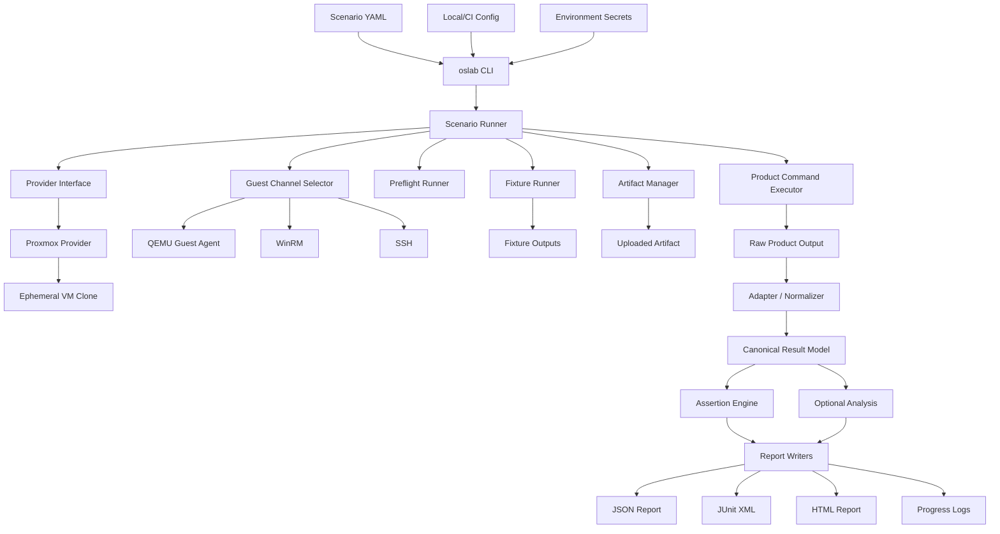
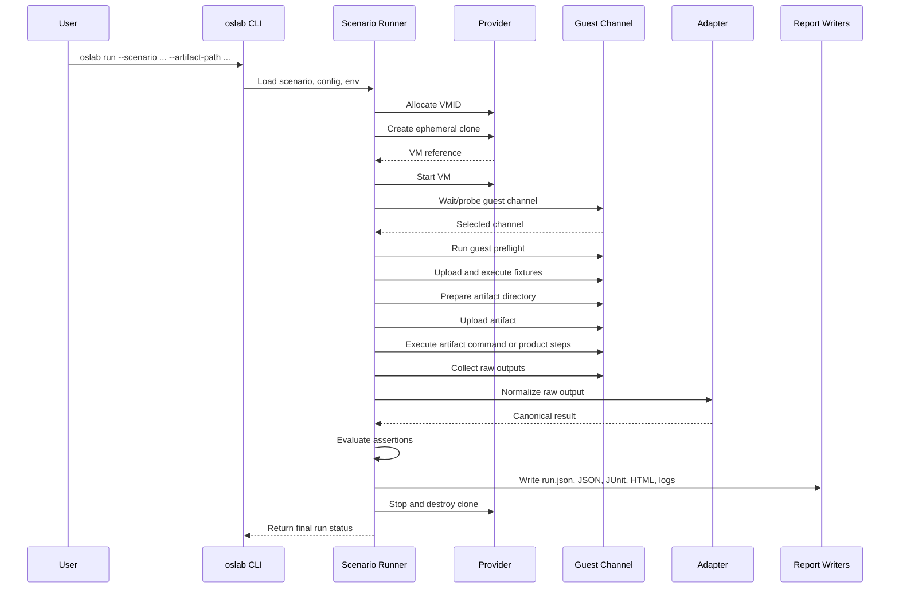
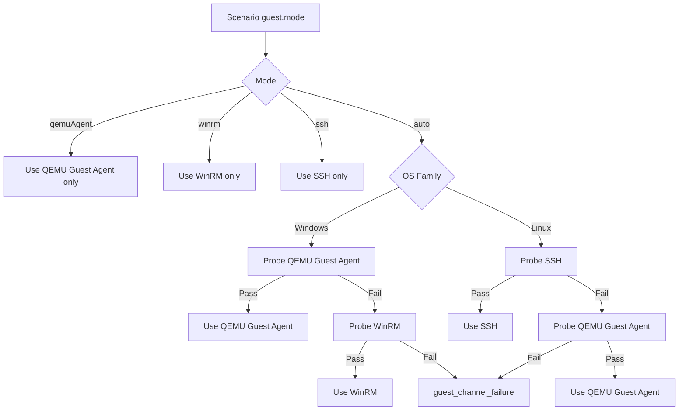
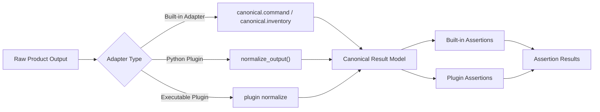
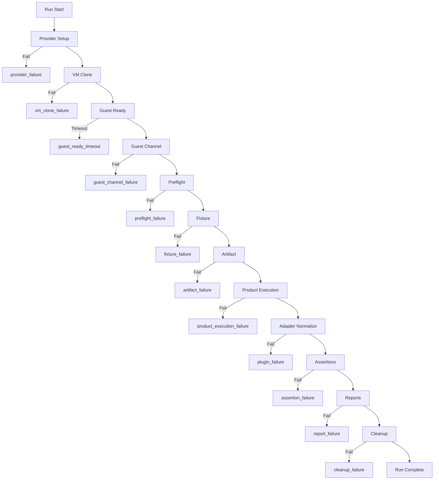

# oslab Platform Plan

## Executive Summary

`oslab is a provider-driven, scenario-based OS integration test platform for validating software inside disposable Windows and Linux VMs.`

`oslab`의 공개 목표는 특정 제품 전용 validation 도구가 아니라, 다양한 OS version, OS setting, runtime state, preinstalled software 조합에서 software artifact를 반복 검증하는 범용 OS/VM integration test platform입니다.

현재 공개 진입점은 Windows Proxmox template에서 실행되는 generic demo suite입니다. 이 demo suite는 제품 지식 없이도 다음 기능을 검증합니다.

- Proxmox template에서 disposable VM clone 생성
- QEMU Guest Agent 기반 guest readiness 확인
- Fixture로 guest runtime/toolchain 준비
- Artifact folder upload
- Guest command execution
- Output collection
- Canonical result normalization
- Assertion evaluation
- JSON, JUnit XML, HTML report 생성
- Run progress log 실시간 기록
- VM cleanup

제품별 adapter, private scenario, private credential 흐름은 public platform plan의 중심이 아닙니다. 이 문서는 `oslab` core가 어떤 경계와 계약을 가져야 하는지 설명합니다.

## Why It Exists

Unit test, mock test, container test는 빠르고 중요하지만 실제 OS 환경에서만 드러나는 문제를 모두 잡지는 못합니다.

예시:

- 같은 artifact가 Windows 10, Windows 11, Windows Server, Ubuntu 등에서 모두 동작하는가?
- Clean image와 이미 여러 runtime이 설치된 image에서 동작이 같은가?
- Registry, service, policy, firewall, user context, language pack, patch level 차이를 견디는가?
- Runtime prerequisite이 없는 VM에서도 fixture가 환경을 준비하고 test를 안정적으로 실행하는가?
- CI가 여러 OS/state 조합의 결과를 같은 report format으로 비교할 수 있는가?

`oslab`은 이 문제를 product마다 새로 풀지 않기 위해 만들어진 platform입니다. VM lifecycle, guest command/file transport, fixtures, artifact execution, assertions, reports를 core가 담당하고, 제품 고유 output 해석은 adapter/plugin으로 격리합니다.

## Public Documentation Boundary

공개 문서는 generic demo와 product-neutral platform 개념을 중심으로 유지합니다.

| Content | Public docs role |
| --- | --- |
| Generic demo suite | 기본 학습 경로 |
| Proxmox/QGA setup | lab 연결 및 template 준비 |
| Scenario YAML | 범용 test recipe 작성법 |
| Fixture | VM 안 test prerequisite 준비 |
| Artifact | 테스트 대상 파일/folder/installer |
| Canonical command result | 작은 executable/CLI smoke 결과 |
| Canonical inventory result | inventory-producing product의 공통 결과 model |
| Product-specific scenarios | 별도 private/product docs로 분리 |

## Scope

| Area | Implemented/Public MVP | Future |
| --- | --- | --- |
| Provider | Proxmox | libvirt, cloud VM providers, local runners |
| OS | Windows execution with QEMU Guest Agent | Linux execution with SSH/QGA |
| Demo products | PowerShell system, Python hello world, C hello world, fixture state handoff, agent steps, intentional failure | Go, .NET, service, installer demos |
| Artifact type | Folder, installer-oriented flow | Remote artifact source, package registry |
| Fixtures | Windows PowerShell fixtures | Linux shell fixtures, reusable fixture catalog |
| Guest channel | QEMU Guest Agent for Windows path | WinRM fallback, SSH primary for Linux |
| Result models | `canonical.command`, `canonical.inventory` | More canonical schemas |
| Reports | JSON, JUnit XML, HTML, progress logs | TRX, dashboard, trend comparison |
| Test definition | YAML scenario | Versioned schemas, UI authoring |
| CI | Thin CLI wrapper model | GitHub/GitLab examples, matrix templates |

## Core Principles

| Principle | Decision |
| --- | --- |
| Product neutrality | Core must not depend on private product code or private scenario semantics. |
| Disposable execution | Default run creates and destroys one ephemeral VM clone. |
| Scenario-first | YAML scenario is the public test definition interface. |
| Provider abstraction | Proxmox is the first provider, not a permanent core assumption. |
| Guest abstraction | QGA, WinRM, and SSH implement the same command/file interface. |
| Fixture separation | VM preparation is separate from product execution. |
| Artifact separation | The artifact is the thing being tested, not the lab setup. |
| Structured failure | Provider, VM, guest, fixture, artifact, product, assertion, report, cleanup failures are separated. |
| CI neutrality | Local and CI execution use the same CLI contract. |
| Evidence-first reports | Every run produces logs, raw data, normalized data, and reports under `runs/<run-id>/`. |

## High-Level Architecture



## Component Responsibilities

| Component | Responsibility | Product-specific? |
| --- | --- | --- |
| CLI | Parse commands, options, config paths, env file paths | No |
| Scenario Loader | Parse and validate YAML scenario shape | No |
| Config Resolver | Merge CLI, scenario, local config, env, defaults | No |
| Scenario Runner | Orchestrate one run lifecycle | No |
| Provider | VM clone/start/stop/destroy/status | No |
| Guest Channel | Execute commands and upload/download files inside VM | No |
| Preflight Runner | Verify guest readiness and baseline capabilities | No |
| Fixture Runner | Prepare OS/runtime/tooling state before artifact execution | Mostly no |
| Artifact Manager | Upload artifact folder/installer and prepare remote paths | No |
| Product Command Executor | Execute scenario-defined command or ordered steps | No |
| Adapter / Normalizer | Convert raw output into canonical result | Sometimes |
| Assertion Engine | Evaluate pass/fail/error/skipped | No |
| Analysis | Summarize canonical result quality/distribution | No |
| Report Writers | Emit JSON, JUnit XML, HTML, progress logs | No |

## Execution Sequence



## Configuration Model

Local lab settings are stored in ignored config files. Secret values are read from environment variables or an env file and must not be committed.

```yaml
providerDefaults:
  proxmox:
    apiUrl: "https://proxmox.example.local:8006"
    node: "pve01"
    verifyTls: false
    timeoutSeconds: 30
    tokenEnv:
      id: OSLAB_PROXMOX_TOKEN_ID
      secret: OSLAB_PROXMOX_TOKEN_SECRET
runDefaults:
  outputRoot: runs
  keepVmOnFailure: false
```

Resolution order:

1. CLI args
2. Scenario YAML
3. Local config file
4. Environment variables/env file
5. Built-in defaults

## CLI Contract

Main public commands:

```powershell
uv run oslab validate-scenario --scenario scenarios/windows/demo-python-hello.example.yaml
uv run oslab preflight --scenario scenarios/windows/demo-python-hello.example.yaml --provider-resource-check
uv run oslab run --scenario scenarios/windows/demo-python-hello.example.yaml --artifact-path validation/artifacts/hello-python
uv run oslab inspect-result --run-dir runs\<run-id>
```

Debug and local analysis commands:

```powershell
uv run oslab boot-smoke --scenario scenarios/windows/demo-python-hello.example.yaml --keep-vm
uv run oslab guest-preflight --scenario scenarios/windows/demo-python-hello.example.yaml
uv run oslab qga-exec --vm-id 9102 -- powershell.exe -NoProfile -Command whoami
uv run oslab normalize-output --scenario scenarios/windows/fake-artifact-smoke.example.yaml --input-json raw.json --output-json normalized.json
uv run oslab assert-result --scenario scenarios/windows/demo-python-hello.example.yaml --actual-json result.json
```

Exit code categories:

| Exit Code | Meaning |
| --- | --- |
| `0` | Passed |
| `10-19` | Scenario/config/preflight failure |
| `20-29` | Provider/VM/guest failure |
| `30-39` | Fixture/artifact/product execution failure |
| `40-49` | Adapter/assertion/report failure |
| `50-59` | Cleanup/stale resource failure |

## Provider Abstraction

`Provider` owns VM lifecycle only. It does not execute commands inside the guest.

```python
class Provider:
    def create_clone(self, template, vm_spec): ...
    def start_vm(self, vm): ...
    def stop_vm(self, vm): ...
    def destroy_vm(self, vm): ...
    def get_vm_status(self, vm): ...
    def get_guest_info(self, vm): ...
```

| Method | Proxmox MVP behavior |
| --- | --- |
| `create_clone` | Clone from a stopped template VM |
| `start_vm` | Start clone and poll task completion/status |
| `stop_vm` | Stop clone before destroy when needed |
| `destroy_vm` | Destroy clone with purge |
| `get_vm_status` | Read VM status from Proxmox |
| `get_guest_info` | Read guest agent/network info when available |

### Proxmox Task Handling

Proxmox operations commonly return async task ids. The provider must poll completion rather than assuming the request is done.

| Operation | Required handling |
| --- | --- |
| clone | Poll task completion; classify timeout/error as `vm_clone_failure` |
| start | Poll VM running status; guest readiness is checked separately |
| stop | Treat already-stopped VM as success |
| destroy | Poll task completion; write stale VM metadata on failure |

### VMID Allocation

```yaml
provider:
  type: proxmox
  template: windows11-template-qga
  templateVmId: 9101
  vmIdRange:
    start: 9102
    end: 9199
```

Rules:

- If `--vm-id` is supplied, use it.
- Otherwise allocate the first available VMID in `vmIdRange`.
- Use a local lock under the run output root to reduce local collision risk.
- CI concurrency should be controlled by resource groups/job concurrency.
- Allocation failure is `provider_failure`.

## Guest Channel API

```python
class GuestChannel:
    def probe(self): ...
    def upload(self, local_path, remote_path): ...
    def download(self, remote_path, local_path): ...
    def exec(self, command, timeout): ...
```

Command result shape:

```json
{
  "exitCode": 0,
  "stdout": "hello\n",
  "stderr": "",
  "durationMs": 1234,
  "channel": "qemuAgent"
}
```

| Channel | OS | Role |
| --- | --- | --- |
| QEMU Guest Agent | Windows, Linux | Current Windows execution path |
| WinRM | Windows | Future/fallback Windows channel |
| SSH | Linux | Future primary Linux channel |

## Guest Channel Selection Flow



## Guest Preflight Contract

Preflight checks that the clone can execute the scenario before doing expensive artifact work.

Windows MVP checks:

| Check | Meaning | Failure |
| --- | --- | --- |
| `powershell.version` | PowerShell can run | `preflight_failure` |
| `windows.admin` | Commands run in admin-capable context | `preflight_failure` |
| `powershell.execution_policy` | Execution policy is queryable | `preflight_failure` |
| `oslab.directory` | `C:\Oslab` can be created | `preflight_failure` |
| `oslab.file_roundtrip` | Guest upload/download works | `preflight_failure` |
| `oslab.cleanup_test_file` | Temporary files can be removed | `preflight_failure` |

Linux design checks:

| Check | Meaning | Failure |
| --- | --- | --- |
| `shell.available` | `sh` or configured shell can run | `preflight_failure` |
| `workdir.writable` | `/tmp/oslab` or configured workdir is writable | `preflight_failure` |
| `os-release.readable` | `/etc/os-release` can be read | `preflight_failure` |
| `file.roundtrip` | Upload/download works through SSH/SFTP or QGA | `preflight_failure` |

## Fixture Model

Fixtures prepare the VM before the artifact is executed.

They are for:

- Installing or locating runtime prerequisites
- Preparing registry, files, services, policy, test data
- Creating expected output/reference data
- Verifying that the guest has the baseline needed by the scenario

They are not for:

- Running the product under test as the main validation target
- Hiding product execution failures as setup failures
- Storing secret values in scenario files

Example:

```yaml
fixtures:
  - id: demo-python-runtime
    type: powershell
    source: validation/fixtures/windows/demo-python-runtime.ps1
    expectedOutput: "C:\\Oslab\\demo-python-runtime.json"
```

If a Python runtime is absent, the fixture may install a portable runtime inside the disposable clone. If fixture setup fails, the run should stop as `fixture_failure`.

## Artifact Interface

Supported public MVP artifact types:

```yaml
artifact:
  type: folder
  pathParam: artifactPath
  destination: "C:\\Oslab\\artifact"
  transfer: archive
```

```yaml
artifact:
  type: installer
  pathParam: artifactPath
  destination: "C:\\Oslab\\installer\\app-installer.exe"
  installCommand:
    shell: powershell
    template: '& "{InstallerPath}" /quiet /norestart'
```

| Type | Behavior |
| --- | --- |
| `folder` | Upload local folder to guest, then run scenario command |
| `installer` | Upload installer, run install command, then run scenario command/steps |

## Scenario YAML Contract

Required top-level fields:

| Field | Required | Description |
| --- | --- | --- |
| `schemaVersion` | Yes | Scenario schema version |
| `id` | Yes | Stable scenario id |
| `os` | Yes | OS family/version |
| `provider` | Yes | Provider type/template |
| `guest` | Yes | Guest command strategy |
| `artifact` | Optional | Artifact upload/install contract |
| `fixtures` | Optional | OS setup scripts |
| `product` | Optional | Ordered command steps for agent-like products |
| `outputs` | Optional | Files to collect |
| `assertions` | Yes | Built-in/plugin assertions |
| `reports` | Optional | Report formats |
| `cleanup` | Optional | VM cleanup policy |

### Windows Python Demo Scenario

```yaml
schemaVersion: 1
id: demo.python-hello.windows
name: Generic Python hello world Windows demo
os:
  family: windows
  version: "11"
provider:
  type: proxmox
  template: windows11-template-qga
  templateVmId: 9101
  vmIdRange:
    start: 9102
    end: 9199
isolation:
  mode: ephemeralClone
guest:
  mode: auto
  windowsOrder:
    - qemuAgent
    - winrm
fixtures:
  - id: demo-python-runtime
    type: powershell
    source: validation/fixtures/windows/demo-python-runtime.ps1
    expectedOutput: "C:\\Oslab\\demo-python-runtime.json"
artifact:
  type: folder
  pathParam: artifactPath
  destination: "C:\\Oslab\\artifact"
  transfer: archive
  command:
    shell: powershell
    template: '& "{ArtifactDir}\run-python-demo.ps1" -OutputPath "{OutputPath}"'
outputs:
  actual:
    path: "C:\\Oslab\\command-result.json"
    adapter: canonical.command
assertions:
  - type: command.exitCode
    id: python-exit-zero
    exitCode: 0
  - type: command.stdoutContains
    id: python-stdout-hello
    text: hello from python
reports:
  formats:
    - junit
    - json
    - html
cleanup:
  destroyVm: true
  keepVmOnFailure: false
```

### Windows C Demo Scenario

```yaml
schemaVersion: 1
id: demo.c-hello.windows
name: Generic C hello world Windows demo
os:
  family: windows
provider:
  type: proxmox
  template: windows11-template-qga
  templateVmId: 9101
guest:
  mode: auto
fixtures:
  - id: demo-c-compiler
    type: powershell
    source: validation/fixtures/windows/demo-c-compiler.ps1
artifact:
  type: folder
  pathParam: artifactPath
  destination: "C:\\Oslab\\artifact"
  transfer: archive
  command:
    shell: powershell
    template: '& "{ArtifactDir}\run-c-demo.ps1" -OutputPath "{OutputPath}"'
outputs:
  actual:
    path: "C:\\Oslab\\command-result.json"
    adapter: canonical.command
assertions:
  - type: command.exitCode
    id: c-exit-zero
    exitCode: 0
  - type: command.stdoutContains
    id: c-stdout-hello
    text: hello from c
```

### Linux Design Scenario

Linux execution is a design target. The schema should not require Windows-only concepts.

```yaml
schemaVersion: 1
id: demo.shell-hello.linux
name: Generic Linux shell hello demo
os:
  family: linux
provider:
  type: proxmox
  template: ubuntu-2404-base-template
  vmIdRange:
    start: 9200
    end: 9299
guest:
  mode: auto
  linuxOrder:
    - ssh
    - qemuAgent
fixtures:
  - id: baseline
    type: shell
    source: validation/fixtures/linux/generic-smoke.sh
artifact:
  type: folder
  pathParam: artifactPath
  destination: "/tmp/oslab/artifact"
  command:
    shell: sh
    template: '"{ArtifactDir}/hello.sh" > "{OutputPath}"'
outputs:
  actual:
    path: "/tmp/oslab/command-result.json"
    adapter: canonical.command
assertions:
  - type: command.exitCode
    id: shell-exit-zero
    exitCode: 0
```

## Command Template Rules

Command templates are necessary because product entrypoints differ. They are risky because shell quoting differs by OS and channel.

Rules:

- Scenario commands must declare `shell`.
- Supported MVP shells are `powershell`, `cmd`, `sh`, and `bash`.
- Token replacement is limited to documented tokens.
- Unknown tokens fail before guest execution.
- Rendered command metadata must redact secret values.
- Secret values must not be written to reports or progress logs.

Supported public tokens:

| Token | Meaning |
| --- | --- |
| `{ArtifactDir}` | Remote artifact directory |
| `{InstallerPath}` | Remote installer path |
| `{OutputPath}` | Remote primary output path |
| `{RunId}` | Current run id |
| `{ScenarioId}` | Scenario id |
| `{VmId}` | Current clone VMID |
| `{WorkDir}` | Remote work directory |

## Product Steps

Simple demos use one `artifact.command`. Agent-like products may need ordered steps such as install, configure, status, run, export. `product.steps` provides that generic execution model.

```yaml
product:
  steps:
    - id: configure
      command:
        shell: powershell
        template: '& "{ArtifactDir}\example-agent.exe" configure --server "{ServerUrl}" --json'
      secretTokens:
        ServerUrl:
          env: OSLAB_PRODUCT_SERVER_URL
      captureStdoutJson: true
    - id: status
      command:
        shell: powershell
        template: '& "{ArtifactDir}\example-agent.exe" status --json'
      captureStdoutJson: true
      expectStdoutJson:
        ok: true
        registered: true
    - id: run
      command:
        shell: powershell
        template: '& "{ArtifactDir}\example-agent.exe" run --output "{OutputPath}" --json'
      captureStdoutJson: true
      expectStdoutJson:
        ok: true
        outputWritten: true
```

Rules:

- Steps run in order.
- A failed required step stops later steps.
- Step stdout/stderr are collected.
- `captureStdoutJson` parses stdout as a JSON object.
- `expectStdoutJson` optionally declares required stdout JSON fields. Dotted keys such as `policy.id` can address nested objects.
- Secret tokens are read from host env and redacted in logs/reports.
- Step results are included in `run.json` and raw output files.

## Adapter And Plugin Model



Python plugin protocol:

```python
def plugin_metadata() -> dict: ...

def normalize_output(context, raw_output_path): ...

def assertions() -> list: ...
```

Executable plugin protocol:

```powershell
plugin.exe normalize --input raw.json --output normalized.json --context context.json
plugin.exe assert --input normalized.json --scenario scenario.fragment.json --output assertions.json
```

Failure rules:

- Non-zero plugin process exit is `plugin_failure`.
- Missing/invalid output JSON is `plugin_failure`.
- Valid assertion mismatch is `assertion_failure`.

## Canonical Result Models

### `canonical.command`

Small executable, compiler, CLI, and hello-world smoke tests use `canonical.command`.

```json
{
  "schemaVersion": 1,
  "kind": "commandResult",
  "command": "python hello.py",
  "exitCode": 0,
  "stdout": "hello from python\n",
  "stderr": "",
  "metadata": {
    "runtime": "python"
  }
}
```

### `canonical.inventory`

Inventory-producing products use `canonical.inventory`.

```json
{
  "schemaVersion": 1,
  "kind": "inventory",
  "records": [
    {
      "name": "Example App",
      "version": "1.2.3",
      "publisher": "Example Publisher",
      "sources": ["packageManager"],
      "confidence": "high",
      "evidence": [
        {
          "type": "package",
          "source": "packageManager",
          "path": "example-app"
        }
      ],
      "metadata": {}
    }
  ]
}
```

## Analysis

Analysis is optional and product-neutral. For inventory results, `oslab` can summarize record counts, source distribution, publisher distribution, confidence distribution, and quality warnings.

```powershell
uv run oslab analyze-inventory `
  --inventory-json runs\<run-id>\normalized\inventory.json `
  --output-json runs\<run-id>\reports\inventory.analysis.json
```

## Assertion Model

MVP built-in assertions:

| Assertion | Purpose |
| --- | --- |
| `command.exitCode` | Check normalized command exit code |
| `command.stdoutContains` | Check normalized stdout text |
| `command.stderrContains` | Check normalized stderr text |
| `file.exists` | Check remote file exists |
| `file.notExists` | Check remote file does not exist |
| `directory.exists` | Check remote directory exists |
| `service.exists` | Check OS service exists |
| `process.exists` | Check process exists |
| `package.exists` | Check package exists |
| `inventory.contains` | Check canonical inventory contains matching record |
| `inventory.sourcePresent` | Check source exists in an inventory record |
| `inventory.sourceAbsent` | Check source is absent |
| `inventory.evidencePresent` | Check evidence exists |

`file.*`, `directory.*`, `process.exists`, `service.exists`, and `package.exists` evaluate reported state in normalized output metadata. The core runner does not perform a second guest query during assertion evaluation; scenario artifacts or adapters must emit checked state in fields such as `metadata.files`, `metadata.directories`, `metadata.processes`, `metadata.services`, and `metadata.packages`.

Assertion result:

```json
{
  "id": "python-stdout-hello",
  "status": "passed",
  "severity": "error",
  "message": "stdout contains expected text",
  "details": {}
}
```

Status values:

- `passed`
- `failed`
- `skipped`
- `error`

## Failure Taxonomy



| Failure | Meaning |
| --- | --- |
| `provider_failure` | Provider config/API/auth/setup problem |
| `vm_clone_failure` | Clone operation failed or timed out |
| `guest_ready_timeout` | VM started but guest readiness timed out |
| `guest_channel_failure` | No usable command/file channel |
| `preflight_failure` | OS baseline does not satisfy scenario |
| `fixture_failure` | Fixture failed |
| `artifact_failure` | Artifact upload/install/prepare failed |
| `product_execution_failure` | Product command/step failed |
| `plugin_failure` | Adapter/plugin crashed or violated protocol |
| `assertion_failure` | Validation assertion failed |
| `report_failure` | Report writing failed |
| `cleanup_failure` | VM cleanup failed |

## Report Output Layout

```text
runs/<run-id>/
  run.json
  logs/
    progress.log
    progress.jsonl
    product.stdout.log
    product.stderr.log
  raw/
    actual-output.json
    product-steps.json
    fixture-<id>.expected-output.json
  normalized/
    command-result.json
    inventory.json
  reports/
    result.junit.xml
    result.json
    result.html
    inventory.analysis.json
```

Not every scenario creates every file. Command-result demos create `normalized/command-result.json`; inventory scenarios create `normalized/inventory.json`.

`progress.log` and `progress.jsonl` are written incrementally while the run is active. The text log is for humans; JSONL is for future dashboards and CI parsers.

## JUnit Mapping

| oslab status | JUnit representation |
| --- | --- |
| Infrastructure/setup error | testcase `error` |
| Assertion mismatch | testcase `failure` |
| Optional check skipped | testcase `skipped` |
| Passed assertion | testcase pass |

JSON is the source of truth. JUnit is the CI interface. HTML is the human-readable report.

## Cleanup Policy

Default:

```yaml
cleanup:
  destroyVm: true
  keepVmOnFailure: false
```

Debug override:

```powershell
uv run oslab run --scenario scenarios/windows/demo-python-hello.example.yaml --keep-vm-on-failure
```

Rules:

- Successful runs destroy the clone.
- Failed runs destroy the clone by default.
- `--keep-vm-on-failure` preserves the VM for debugging.
- Cleanup failure writes stale VM metadata to `run.json`.
- Future stale cleanup command removes old validation VMs by label/range.

## Implementation Phases

| Phase | Goal | Public acceptance |
| --- | --- | --- |
| 1. Platform skeleton | CLI, package, run directory basics | `uv run oslab --help` |
| 2. Scenario/config loader | YAML/config/env resolution | `validate-scenario` passes demo scenarios |
| 3. Proxmox provider | Auth, clone/start/stop/destroy/status, VMID allocation | `preflight --provider-resource-check` |
| 4. Guest channel | QGA Windows path, selector contract | Guest can execute PowerShell command |
| 5. Preflight | Guest readiness checks | `guest-preflight` passes template clone |
| 6. Fixtures | PowerShell fixture execution/output collection | Python/C runtime fixtures pass |
| 7. Artifact execution | Folder upload/archive expansion/command execution | Python/C demo commands run |
| 8. Adapters | `canonical.command`, `canonical.inventory` | Normalized JSON written |
| 9. Assertions | Built-in command/inventory assertions | Demo assertions pass/fail deterministically |
| 10. Reports | JSON, JUnit, HTML, progress logs | `runs/<run-id>/reports/*` exists |
| 11. Linux design | Validate Linux schema without Windows assumptions | Linux example scenario validates |
| 12. CI examples | Thin wrappers around CLI | Local/CI command parity |

## Test Plan

### Unit Tests

- Scenario YAML parsing
- Config/env/default resolution
- Command template token replacement
- Secret redaction
- Provider fake implementation
- Guest channel auto-selection
- QGA file transfer helpers
- Fixture execution model
- Artifact folder/archive behavior
- Product step ordering and stdout JSON parsing
- Built-in adapter normalization
- Assertion pass/fail/error mapping
- JSON/JUnit/HTML report writers
- Inventory analysis

### Integration Tests Without Real VM

Use fake provider and fake guest channel.

| Scenario | Expected result |
| --- | --- |
| Python command success | Passed |
| C command success | Passed |
| Fixture failure | `fixture_failure` and product command skipped |
| Artifact upload failure | `artifact_failure` |
| Product non-zero exit | `product_execution_failure` |
| Assertion mismatch | `assertion_failure` with reports written |
| Cleanup failure | Stale VM metadata recorded |
| Linux scenario validation | Schema pass, real execution skipped until SSH implementation |

### Real Lab Smoke Tests

Requires:

- Proxmox API access
- Windows template VM
- QEMU Guest Agent installed in Windows
- QEMU Guest Agent enabled in Proxmox VM options
- Guest internet access if demo fixtures download runtime/toolchain

Python demo:

```powershell
uv run oslab run `
  --scenario scenarios/windows/demo-python-hello.example.yaml `
  --config config/oslab.local.yaml `
  --env-file config/oslab.local.env `
  --artifact-path validation/artifacts/hello-python
```

C demo:

```powershell
uv run oslab run `
  --scenario scenarios/windows/demo-c-hello.example.yaml `
  --config config/oslab.local.yaml `
  --env-file config/oslab.local.env `
  --artifact-path validation/artifacts/hello-c
```

Pass criteria:

- Ephemeral clone created
- VM reaches running state
- QGA becomes ready
- Guest preflight passes
- Fixture prepares runtime/toolchain
- Artifact uploads by archive transfer
- Product command exits `0`
- Output JSON is collected
- `canonical.command` result is written
- Assertions pass
- JSON/JUnit/HTML reports are created
- VM clone is destroyed

## Implementation Readiness Checklist

- [ ] Public docs describe generic OS/VM integration testing, not a private product workflow.
- [ ] Scenario schema is stable enough for public demo use.
- [ ] Provider API does not leak Proxmox-specific fields into core contracts.
- [ ] Guest channel selection supports Windows now and Linux later.
- [ ] Fixtures are clearly documented as VM environment setup.
- [ ] Artifact execution is separate from fixture setup.
- [ ] Product-specific logic is isolated in adapters/plugins/scenarios.
- [ ] Reports are product-neutral.
- [ ] Failure taxonomy covers setup, execution, validation, report, and cleanup.
- [ ] Local and CI execution use the same CLI contract.
- [ ] Fake provider/guest tests can validate core without a real Proxmox lab.
- [ ] Demo scenarios are enough for new users to learn the platform without private product knowledge.

## Public Release Notes For This Plan

Before publishing the repository:

- Keep public README focused on generic demo usage.
- Keep private/product-specific scenario notes outside the public platform plan.
- Do not commit local config, env files, lab IPs, API tokens, or product credentials.
- Make sure `demo-python-hello` and `demo-c-hello` are the first learning path.
- Make sure Proxmox template prerequisites are documented before the run command.
- Make sure `runs/` artifacts are ignored or cleaned before release.
