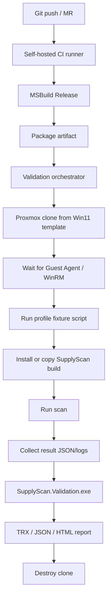

# SupplyScan Validation CI 처음부터 구축하기

> Legacy note: 이 문서는 초기 SupplyScan 전용 validation CI 설계 기록입니다. 현재 범용 플랫폼 구현 기준은 `docs/oslab-platform-plan.md`와 `docs/devs/oslab-implementation-checklist.md`입니다. 이 문서의 `9000`, `9100-9199` 같은 VMID 예시는 역사적 예시이며, 현재 lab 기준은 template VMID `9101`, clone range `9102-9199`입니다.

## 목표

기능을 구현한 뒤 사람이 Windows VM에 들어가 수동 확인하는 흐름을 줄이고, 아래 루프를 자동화합니다.

```text
push / merge request
  -> agent-windows 빌드
  -> validation artifact 준비
  -> Proxmox Windows clone 생성
  -> profile fixture 적용
  -> SupplyScan 설치/실행
  -> 결과 수집
  -> expected manifest와 비교
  -> TRX/JSON/HTML report 생성
  -> clone 삭제
```

처음부터 완전한 gold image matrix를 만들지 않습니다. `gold-lite` 1개 profile로 시작하고, 안정화되면 `appx`, `service`, `task`, `portable`, `pkgmgr` profile을 추가합니다.

## 핵심 판단

| 항목 | 결정 |
| --- | --- |
| VM 전략 | base Windows template 1개 + 실행마다 ephemeral clone |
| profile 전략 | VM을 여러 개 손으로 만들지 않고 profile PowerShell로 fixture 상태를 만듭니다. |
| CI runner | Proxmox에 접근 가능한 self-hosted runner가 필요합니다. |
| 결과 포맷 | .NET/C# 생태계에 맞춰 `TRX + JSON + HTML`을 기본으로 둡니다. |
| release gate | 모든 push가 아니라 MR smoke, nightly full, release proof로 tier를 나눕니다. |
| Procmon | 매번 돌리는 CI가 아니라 release candidate forensic proof로 둡니다. |

## 전체 아키텍처



## Phase 0: 사전 결정

| 결정 | 추천값 | 이유 |
| --- | --- | --- |
| base template 이름 | `win11-supplyscan-base-template` | 용도가 명확합니다. |
| base template VMID | `9000` 같은 고정 ID | 스크립트에서 참조하기 쉽습니다. |
| first profile | `gold-lite` | 현재 VM에 이미 있는 known app으로 시작 가능합니다. |
| clone VMID range | `9100-9199` | validation run 전용 범위로 충돌을 줄입니다. |
| guest command 방식 | 1순위 QEMU Guest Agent, 2순위 WinRM | Proxmox 안에서 폐쇄적으로 실행하기 쉽습니다. |
| output format | TRX, JSON, HTML | CI/기계/사람이 각각 소비합니다. |

## Phase 1: Base Windows Template 만들기

이 단계는 처음 1회만 수동 또는 반수동으로 진행합니다.

### Base template에 포함할 것

| 항목 | 필수 여부 | 메모 |
| --- | --- | --- |
| Windows 11 설치 | 필수 | Proxmox VM으로 설치합니다. |
| VirtIO driver | 필수 | disk/network 안정성 때문에 필요합니다. |
| QEMU Guest Agent | 필수 | 파일 복사, 명령 실행, IP 확인 자동화에 필요합니다. |
| 관리자 계정 | 필수 | fixture/service/task 등록에 필요합니다. |
| PowerShell 실행 정책 | 필수 | validation profile 실행을 위해 필요합니다. |
| WinRM | 선택 | Guest Agent exec가 안정적이면 없어도 됩니다. |
| SupplyScan installer prerequisites | 권장 | .NET Framework, VC runtime 등 필요한 항목이 있으면 포함합니다. |
| Windows Update 고정 | 권장 | test repeatability를 위해 snapshot 기준을 고정합니다. |

### Base template 준비 순서

1. Proxmox에서 Windows 11 VM을 생성합니다.
2. VirtIO storage/network driver를 설치합니다.
3. QEMU Guest Agent를 설치하고 Proxmox VM 설정에서 Guest Agent를 켭니다.
4. 관리자 계정을 준비합니다.
5. PowerShell script 실행이 가능하도록 설정합니다.
6. 불필요한 자동 업데이트/초기 설정 팝업을 정리합니다.
7. VM을 종료합니다.
8. Proxmox에서 template로 변환하거나 clean snapshot을 만듭니다.

### 확인 명령 예시

Proxmox host에서:

```bash
qm agent 9000 ping
qm agent 9000 network-get-interfaces
```

Windows guest에서:

```powershell
Get-ExecutionPolicy -List
$PSVersionTable
```

## Phase 2: Repository 구조 추가

추천 구조:

```text
validation/
  README.md
  config/
    validation.local.example.json
  expected/
    gold-lite.expected_inventory.json
  profiles/
    gold-lite.ps1
    appx.ps1
    service.ps1
    task.ps1
    portable.ps1
  scripts/
    New-ValidationVm.ps1
    Wait-ValidationVm.ps1
    Invoke-ValidationProfile.ps1
    Install-ValidationAgent.ps1
    Start-ValidationScan.ps1
    Collect-ValidationResults.ps1
    Remove-ValidationVm.ps1
    Invoke-ValidationRun.ps1
  SupplyScan.Validation/
    SupplyScan.Validation.csproj
    Program.cs
    ExpectedInventory.cs
    ActualInventory.cs
    InventoryValidator.cs
    TrxReportWriter.cs
    JsonReportWriter.cs
    HtmlReportWriter.cs
```

처음에는 모든 파일을 만들 필요 없습니다. MVP는 아래만 있으면 됩니다.

```text
validation/
  expected/gold-lite.expected_inventory.json
  profiles/gold-lite.ps1
  scripts/Invoke-ValidationRun.ps1
  SupplyScan.Validation/
```

## Phase 3: `gold-lite` profile 만들기

처음에는 새 앱을 설치하지 말고 base VM에 이미 있는 known app을 fixture로 삼습니다. 이 방식이 제일 빠릅니다.

예시 `validation/profiles/gold-lite.ps1`:

```powershell
$root = "C:\SupplyScanValidation"
New-Item -ItemType Directory -Force -Path $root | Out-Null

$manifest = @{
  schema_version = 1
  image_id = "gold-lite"
  fixtures = @(
    @{
      id = "known-registry-git"
      name_contains = "Git"
      required_sources = @("Registry")
    },
    @{
      id = "known-registry-chrome"
      name_contains = "Google Chrome"
      required_sources = @("Registry")
    }
  )
}

$manifest |
  ConvertTo-Json -Depth 10 |
  Set-Content -Encoding UTF8 "$root\expected_inventory.json"
```

주의: base VM에 Git/Chrome이 없다면 실제 설치된 known app으로 바꿉니다. 핵심은 fixture를 작게 시작하는 것입니다.

## Phase 4: Expected manifest schema

초기 schema는 과하게 만들지 않습니다.

```json
{
  "schema_version": 1,
  "image_id": "gold-lite",
  "fixtures": [
    {
      "id": "known-registry-git",
      "name_contains": "Git",
      "required_sources": ["Registry"],
      "optional_sources": ["PE", "StartMenu"],
      "must_not_sources": ["Portable"]
    }
  ]
}
```

최소 필드:

| 필드 | 의미 |
| --- | --- |
| `id` | fixture 식별자 |
| `name_contains` | 이름 매칭 조건 |
| `required_sources` | 반드시 나와야 하는 evidence source |
| `optional_sources` | 나오면 좋은 source |
| `must_not_sources` | 나오면 안 되는 source |

나중에 추가할 필드:

| 필드 | 의미 |
| --- | --- |
| `version_contains` | 버전 검증 |
| `publisher_contains` | publisher 검증 |
| `path_contains` | evidence path 검증 |
| `package_family_contains` | Appx 검증 |
| `service_name` | service fixture 검증 |
| `task_path` | scheduled task 검증 |
| `confidence_at_least` | heuristic confidence 검증 |

## Phase 5: Scanner output을 검증 가능하게 만들기

결과 JSON에 앱 이름만 있으면 validation이 약합니다. 채널별 evidence를 남겨야 합니다.

권장 software record:

```json
{
  "name": "Google Chrome",
  "version": "123.0.0.0",
  "sources": ["Registry", "PE"],
  "confidence": "high",
  "evidence": [
    {
      "type": "registry",
      "source": "Registry",
      "path": "HKLM\\Software\\Microsoft\\Windows\\CurrentVersion\\Uninstall\\Google Chrome"
    },
    {
      "type": "file",
      "source": "PE",
      "path": "C:\\Program Files\\Google\\Chrome\\Application\\chrome.exe"
    }
  ],
  "degraded_reason": null
}
```

처음에는 기존 `sw_scan_method`를 `sources`로 변환해도 됩니다. 이후 채널별 evidence list를 추가합니다.

## Phase 6: Validation checker 만들기

추천: C# console app.

실행 예:

```powershell
SupplyScan.Validation.exe `
  --expected C:\SupplyScanValidation\expected_inventory.json `
  --actual C:\SupplyScanValidation\scan-result.json `
  --out C:\SupplyScanValidation\report `
  --format trx,json,html
```

검증 단위:

| Test case | PASS 기준 |
| --- | --- |
| `fixture.<id>.exists` | actual inventory에서 매칭되는 record 존재 |
| `fixture.<id>.required_source.<source>` | record source/evidence에 required source 존재 |
| `fixture.<id>.must_not_source.<source>` | 금지 source가 없음 |
| `fixture.<id>.evidence_present` | positive match에 evidence가 존재 |

결과 파일:

```text
validation-result.trx
validation-result.json
validation-report.html
```

TRX를 쓰는 이유:

- C#/.NET Framework 프로젝트와 잘 맞습니다.
- Visual Studio/VSTest 생태계에서 자연스럽습니다.
- CI artifact로 올리기 쉽습니다.

## Phase 7: Proxmox 자동화 script

초기에는 Terraform/Packer까지 가지 않아도 됩니다. PowerShell에서 Proxmox API 또는 SSH `qm` 명령을 호출하는 방식이 빠릅니다.

### `Invoke-ValidationRun.ps1` 흐름

```powershell
param(
  [string]$Profile = "gold-lite",
  [int]$TemplateVmId = 9000,
  [int]$VmId = 9101,
  [string]$ArtifactPath
)

try {
  .\New-ValidationVm.ps1 -TemplateVmId $TemplateVmId -VmId $VmId -Name "validation-$Profile-$VmId"
  .\Wait-ValidationVm.ps1 -VmId $VmId
  .\Invoke-ValidationProfile.ps1 -VmId $VmId -Profile $Profile
  .\Install-ValidationAgent.ps1 -VmId $VmId -ArtifactPath $ArtifactPath
  .\Start-ValidationScan.ps1 -VmId $VmId
  .\Collect-ValidationResults.ps1 -VmId $VmId -Out ".\validation\runs\$Profile-$VmId"
  .\SupplyScan.Validation\bin\Release\SupplyScan.Validation.exe `
    --expected ".\validation\runs\$Profile-$VmId\expected_inventory.json" `
    --actual ".\validation\runs\$Profile-$VmId\scan-result.json" `
    --out ".\validation\runs\$Profile-$VmId\report" `
    --format trx,json,html
}
finally {
  .\Remove-ValidationVm.ps1 -VmId $VmId
}
```

### Proxmox clone 명령 예

Proxmox host에서:

```bash
qm clone 9000 9101 --name validation-gold-lite-9101 --full 0
qm start 9101
```

삭제:

```bash
qm stop 9101
qm destroy 9101 --purge
```

## Phase 8: CI 연결

### Runner 요구사항

| 항목 | 필요성 |
| --- | --- |
| Windows self-hosted runner | .NET Framework/MSBuild 빌드가 쉽습니다. |
| Proxmox 접근 권한 | API token 또는 SSH `qm` 실행 권한이 필요합니다. |
| Artifact 저장 공간 | scan result, logs, TRX/HTML report 저장이 필요합니다. |
| Secret 관리 | Proxmox token, Windows admin credential, signing credential은 CI secret에 둡니다. |

### Pipeline tier

| Tier | 실행 시점 | 내용 |
| --- | --- | --- |
| Build | 모든 push | MSBuild, 기본 compile 확인 |
| Unit | 모든 push | 빠른 unit test |
| Smoke validation | MR | `gold-lite` 1개 clone |
| Full validation | nightly | appx/service/task/portable/pkgmgr profile |
| Proof validation | release candidate | Procmon proof, cold/warm baseline, 반복 실행 |

### GitHub Actions 예시

```yaml
name: windows-agent-validation

on:
  pull_request:
  workflow_dispatch:

jobs:
  build-and-validate:
    runs-on: [self-hosted, windows, supplyscan-validation]
    steps:
      - uses: actions/checkout@v4

      - name: Restore packages
        shell: powershell
        run: nuget restore SupplyScanAgent.sln

      - name: Build
        shell: powershell
        run: msbuild SupplyScanAgent.sln /p:Configuration=Release

      - name: Run gold-lite validation
        shell: powershell
        run: |
          .\validation\scripts\Invoke-ValidationRun.ps1 `
            -Profile gold-lite `
            -TemplateVmId 9000 `
            -ArtifactPath ".\SupplyScanAgent\bin\Release"

      - name: Upload validation artifacts
        uses: actions/upload-artifact@v4
        if: always()
        with:
          name: validation-report
          path: validation/runs/**
```

### GitLab CI 예시

```yaml
stages:
  - build
  - validate

build:
  stage: build
  tags:
    - windows
    - supplyscan-validation
  script:
    - nuget restore SupplyScanAgent.sln
    - msbuild SupplyScanAgent.sln /p:Configuration=Release
  artifacts:
    paths:
      - SupplyScanAgent/bin/Release/
      - SupplyScan.Service/bin/Release/
      - SupplyScanUpdater/bin/Release/

validate:gold-lite:
  stage: validate
  tags:
    - windows
    - supplyscan-validation
  script:
    - powershell -ExecutionPolicy Bypass -File validation/scripts/Invoke-ValidationRun.ps1 -Profile gold-lite -TemplateVmId 9000 -ArtifactPath SupplyScanAgent/bin/Release
  artifacts:
    when: always
    paths:
      - validation/runs/
```

## Phase 9: Profile 확장 순서

처음부터 여러 VM/profile을 만들지 않습니다. 아래 순서로 갑니다.

| 순서 | Profile | 내용 | 이유 |
| --- | --- | --- | --- |
| 1 | `gold-lite` | 현재 base VM에 이미 있는 known Registry/MSI 앱 | 가장 빠른 smoke loop |
| 2 | `service` | `sc.exe create`로 service fixture 생성 | service-only gap 검증 |
| 3 | `task` | `schtasks.exe /Create`로 task fixture 생성 | scheduled-task-only gap 검증 |
| 4 | `portable` | 특정 root에 portable exe 배치 | heuristic 분리 검증 |
| 5 | `appx` | 기본 Appx package smoke, 이후 custom MSIX | Appx gap 검증 |
| 6 | `pkgmgr` | winget/choco/scoop | 외부 설치 변동성이 있어 뒤로 미룹니다. |

## Phase 10: 실패 처리 원칙

| 실패 | 처리 |
| --- | --- |
| clone 생성 실패 | infrastructure failure로 표시하고 retry 가능하게 합니다. |
| guest ready timeout | VM boot/agent failure로 분리합니다. |
| fixture 설치 실패 | profile failure로 표시합니다. |
| scanner 실행 실패 | product failure로 표시합니다. |
| expected fixture missing | validation failure로 표시합니다. |
| 성능 budget 초과 | performance failure 또는 degraded pass로 분리합니다. |
| cleanup 실패 | 다음 run 충돌 방지를 위해 stale VM cleanup job을 둡니다. |

## Phase 11: 보안/운영 주의

- Proxmox API token은 최소 권한으로 만듭니다.
- validation VMID range를 제한합니다.
- runner에서 production Proxmox cluster 전체 권한을 주지 않습니다.
- Windows admin password는 CI secret에 둡니다.
- validation clone은 외부망 접근을 최소화합니다.
- package manager profile은 supply chain 변동성이 있으므로 nightly/manual로 둡니다.
- Procmon trace에는 파일 경로와 사용자 정보가 들어가므로 artifact 보관 범위를 제한합니다.

## MVP 체크리스트

| 상태 | 작업 |
| --- | --- |
| [ ] | Windows 11 base VM 생성 |
| [ ] | VirtIO driver 설치 |
| [ ] | QEMU Guest Agent 설치 및 Proxmox에서 ping 확인 |
| [ ] | base VM을 template/snapshot으로 고정 |
| [ ] | `validation/profiles/gold-lite.ps1` 작성 |
| [ ] | `validation/expected/gold-lite.expected_inventory.json` 작성 |
| [ ] | `SupplyScan.Validation.exe` C# console app 초안 작성 |
| [ ] | `Invoke-ValidationRun.ps1`에서 clone/run/collect/destroy 1회 성공 |
| [ ] | self-hosted runner에서 MSBuild 성공 |
| [ ] | CI에서 `gold-lite` validation artifact 업로드 |

## 최종 목표

처음 목표는 완벽한 gold image farm이 아닙니다.

첫 성공 기준:

```text
MR 하나 올림
  -> Release build 성공
  -> Proxmox clone 1개 생성
  -> gold-lite fixture 실행
  -> SupplyScan scan result 수집
  -> TRX/JSON/HTML validation report 생성
  -> clone 삭제
```

이 루프가 안정화되면 profile을 하나씩 늘리면 됩니다.
