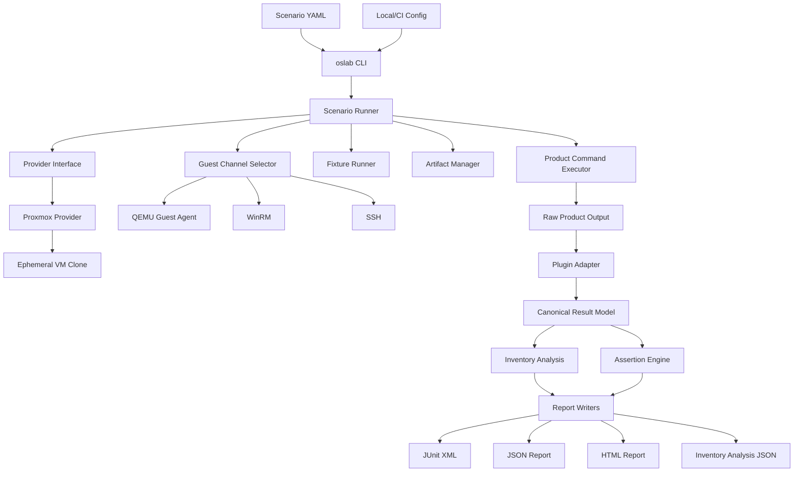
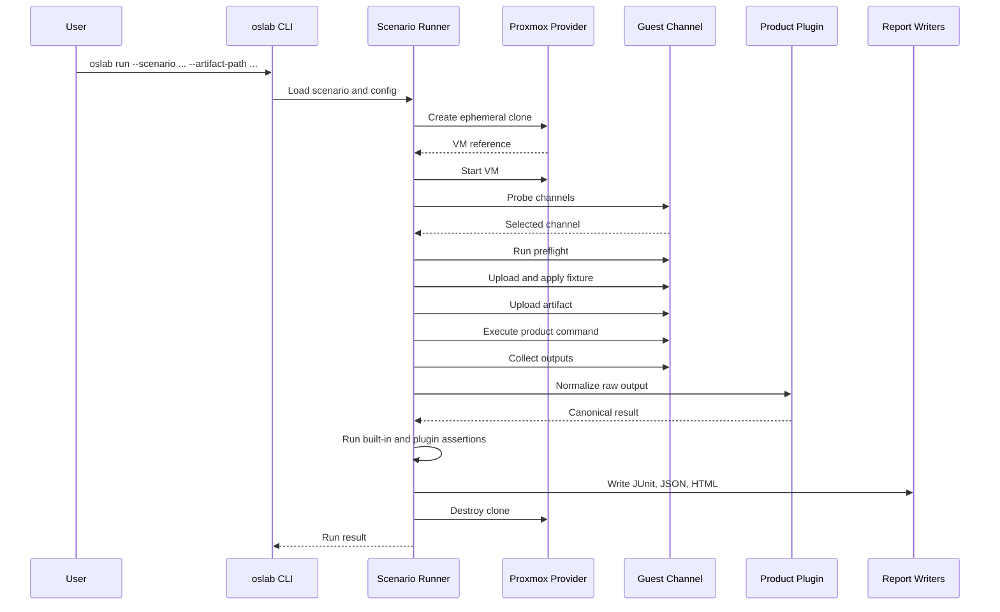
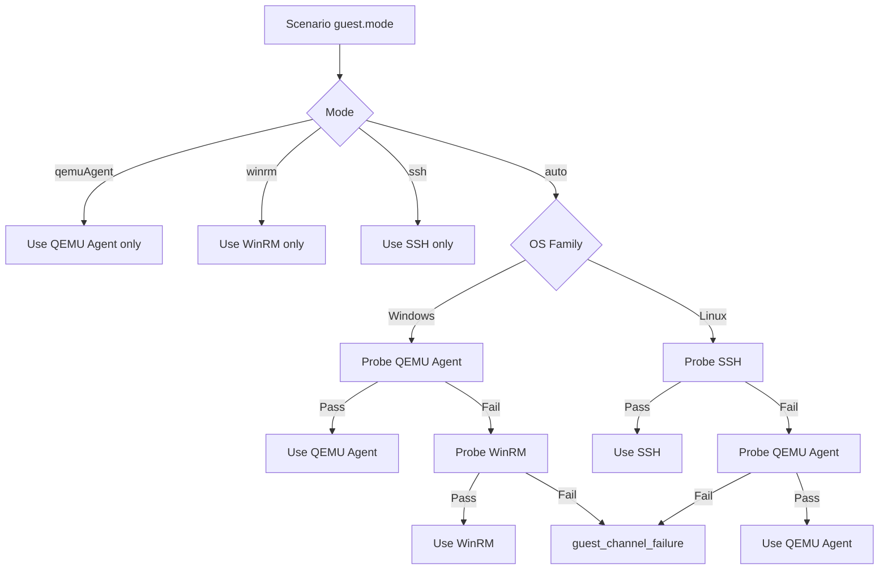
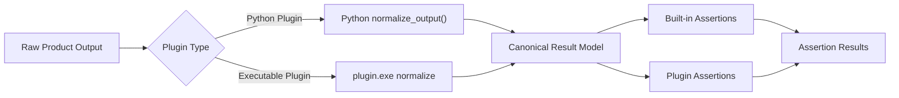
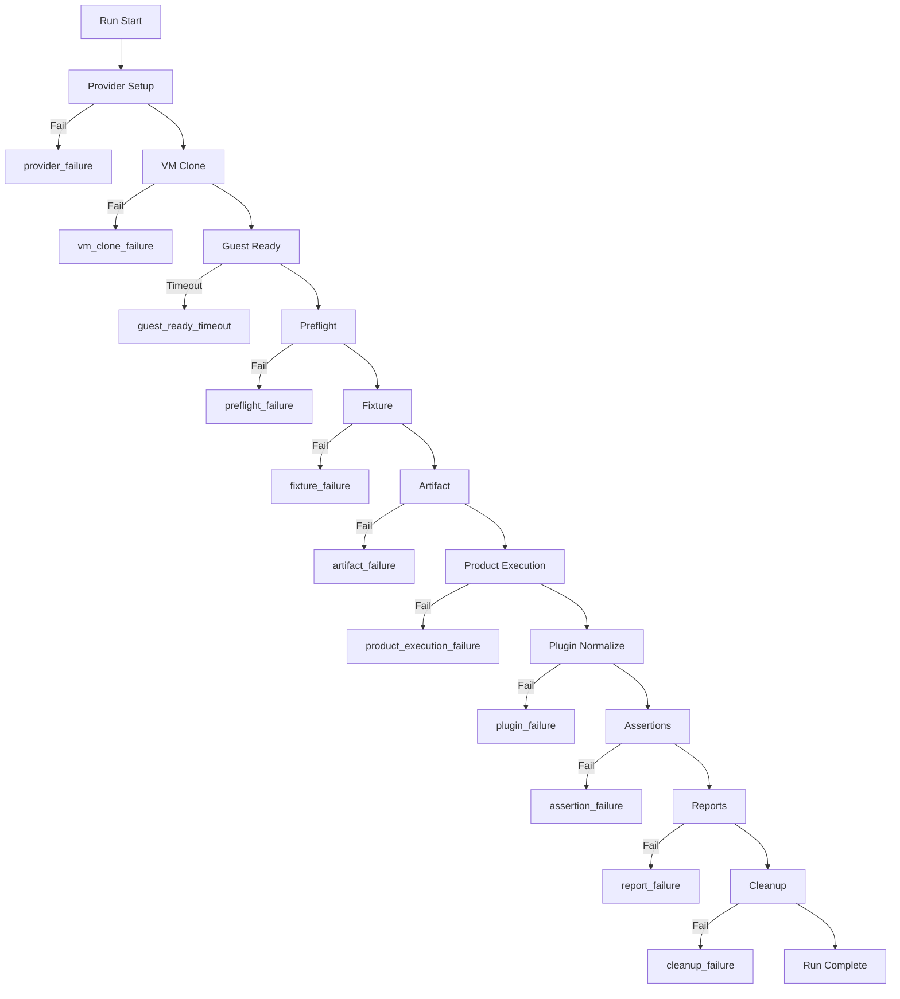

# SupplyScan-Oriented oslab Platform Plan Archive

> Private product note: this file preserves the earlier SupplyScan-oriented platform plan. The public, product-neutral platform plan now lives at `../oslab-platform-plan.md`.

The content below intentionally contains SupplyScan-specific scenario, adapter, and validation details.

## Executive Summary

`oslab is a provider-driven, scenario-based OS integration test platform for validating software inside disposable Windows and Linux VMs.`

`oslab`의 목표는 특정 제품 전용 validation script를 만드는 것이 아니라, OS VM을 만들고, fixture를 적용하고, 제품 artifact를 실행하고, 결과를 검증하고, CI가 소비할 수 있는 report를 만드는 공통 플랫폼을 제공하는 것입니다.

SupplyScan은 첫 번째 실사용 plugin입니다. VM lifecycle, guest command, artifact upload, assertion, report는 core platform이 맡고, SupplyScan raw output을 해석하는 로직만 `plugins/supplyscan`에 둡니다.

## Motivation

기존 [docs/supplyscan_docs/legacy-architecture.md](supplyscan_docs/legacy-architecture.md)는 SupplyScan Windows Agent validation CI를 빠르게 만들기 위한 설계입니다. 그러나 장기적으로는 다음 요구가 있습니다.

- SupplyScan 이외의 C#, Python, Go, agent, CLI, service 제품도 같은 방식으로 OS 통합 테스트를 실행해야 합니다.
- Windows와 Linux가 서로 다른 script 묶음이 아니라 같은 scenario model로 표현되어야 합니다.
- Proxmox clone 생성, guest readiness, file upload/download, command execution, cleanup, report 생성을 제품마다 다시 만들지 않아야 합니다.
- 제품별 raw output은 plugin에서 canonical model로 변환하고, core는 product-neutral assertion과 report만 처리해야 합니다.

이 때문에 `oslab`은 SupplyScan 전용 도구가 아니라 범용 OS/VM test platform으로 설계합니다.

## Scope

| Area | MVP | Future |
| --- | --- | --- |
| Provider | Proxmox | libvirt, cloud, Docker-like local runners |
| OS | Windows implemented, Linux designed | Linux implemented |
| Product | SupplyScan plugin | Any plugin |
| Reports | JUnit, JSON, HTML | TRX, dashboard |
| Test definition | YAML | Versioned schemas, UI authoring |
| Runtime | Python CLI with `uv` | packaged binary, service runner |
| Isolation | Ephemeral clone per run | reusable debug VM, snapshot restore |

## Core Principles

| Principle | Decision |
| --- | --- |
| Product neutrality | Core does not import SupplyScan-specific code. |
| Disposable execution | Default run creates and destroys an ephemeral VM clone. |
| Scenario-first | YAML scenario is the public test definition interface. |
| Provider abstraction | Proxmox is first implementation, not a core assumption. |
| Guest abstraction | QEMU Agent, WinRM, and SSH implement one command/file interface. |
| Structured failure | Infrastructure, fixture, product, assertion, and cleanup failures are separated. |
| CI neutrality | GitLab and GitHub wrappers call the same CLI. |

## High-Level Architecture



## Component Responsibility Table

| Component | Responsibility | Product-Specific? |
| --- | --- | --- |
| CLI | Parse commands and config | No |
| Scenario Runner | Orchestrate one run | No |
| Provider | VM lifecycle | No |
| Guest Channel | Execute/upload/download in VM | No |
| Fixture Runner | Apply OS state | Mostly no |
| Artifact Manager | Upload/install product artifact | No |
| Product Command Executor | Run scenario-defined command templates | No |
| Plugin Adapter | Normalize product output | Yes |
| Inventory Analysis | Summarize canonical inventory quality and distribution | No |
| Assertion Engine | Evaluate pass/fail | No |
| Report Writers | Emit CI/human reports | No |

## Execution Sequence



## CLI Contract

MVP commands:

```powershell
uv run oslab validate-scenario --scenario scenarios/windows/demo-python-hello.example.yaml
uv run oslab preflight --scenario scenarios/windows/demo-python-hello.example.yaml --provider-resource-check
uv run oslab run --scenario scenarios/windows/demo-python-hello.example.yaml --artifact-path validation/artifacts/hello-python
uv run oslab inspect-result --run-dir .\runs\<run-id>
```

Future command:

```powershell
uv run oslab cleanup-stale --provider proxmox --vmid-range 9102-9199
```

Exit code categories:

| Exit Code | Meaning |
| --- | --- |
| `0` | Pass |
| `10-19` | Scenario/config/preflight failure |
| `20-29` | Provider/VM/guest failure |
| `30-39` | Fixture/artifact/product execution failure |
| `40-49` | Plugin/assertion/report failure |
| `50-59` | Cleanup/stale resource failure |

## Configuration Model

일반 설정은 YAML config에 두고, secret은 환경변수에서 읽습니다. Scenario file에는 secret value를 넣지 않습니다.

```yaml
providerDefaults:
  proxmox:
    apiUrl: "https://proxmox.example.local:8006/api2/json"
    node: "pve01"
    verifyTls: false
    tokenEnv:
      id: OSLAB_PROXMOX_TOKEN_ID
      secret: OSLAB_PROXMOX_TOKEN_SECRET
guestDefaults:
  windows:
    usernameEnv: OSLAB_WINDOWS_USERNAME
    passwordEnv: OSLAB_WINDOWS_PASSWORD
  linux:
    usernameEnv: OSLAB_LINUX_USERNAME
    privateKeyPathEnv: OSLAB_LINUX_SSH_KEY
runDefaults:
  outputRoot: runs
  timeoutMinutes: 45
  keepVmOnFailure: false
```

Resolution order:

1. CLI args
2. Scenario YAML
3. Local config file
4. Environment variables
5. Built-in defaults

## Provider Abstraction

`Provider`는 VM lifecycle만 담당합니다. Guest 내부 명령 실행은 provider가 아니라 guest channel이 담당합니다.

```python
class Provider:
    def create_clone(self, template, vm_spec): ...
    def start_vm(self, vm): ...
    def stop_vm(self, vm): ...
    def destroy_vm(self, vm): ...
    def get_vm_status(self, vm): ...
    def get_guest_info(self, vm): ...
```

| Method | Proxmox MVP behavior |
| --- | --- |
| `create_clone` | Clone from template VM |
| `start_vm` | Start clone |
| `stop_vm` | Stop clone before destroy when needed |
| `destroy_vm` | Destroy clone with purge |
| `get_vm_status` | Read Proxmox VM status |
| `get_guest_info` | Read guest agent/network info when available |

### Proxmox Async Task Handling

Proxmox API operations often return an async task id such as `UPID`. The MVP provider must not assume clone/start/stop/destroy completed immediately.

Required behavior:

| Operation | Required handling |
| --- | --- |
| clone | Poll task completion and fail as `vm_clone_failure` on timeout/error |
| start | Poll VM status and guest readiness separately |
| stop | Treat already-stopped VM as success |
| destroy | Poll task completion and record stale VM metadata on failure |

### VMID Allocation

MVP should support explicit VMID and range-based allocation.

```yaml
provider:
  type: proxmox
  template: windows11-template-qga-9101
  templateVmId: 9101
  vmIdRange:
    start: 9102
    end: 9199
```

Allocation rules:

- If `--vm-id` is supplied, use it.
- Otherwise allocate the first available VMID in `vmIdRange`.
- Use a local lock file under the run output root to avoid two local runs choosing the same VMID.
- CI runner concurrency should be controlled by CI resource groups or job concurrency settings.
- If allocation fails, classify as `provider_failure`.

## Guest Channel API

```python
class GuestChannel:
    def probe(self): ...
    def upload(self, local_path, remote_path): ...
    def download(self, remote_path, local_path): ...
    def exec(self, command, timeout): ...
```

| Channel | OS | MVP role | Notes |
| --- | --- | --- | --- |
| QEMU Guest Agent | Windows, Linux | Windows primary | Good for closed Proxmox control path, but file transfer and quoting need wrappers. |
| WinRM | Windows | Windows fallback | Requires network, credentials, firewall, and PowerShell remoting readiness. |
| SSH | Linux | Linux primary design | Linux implementation can use SFTP/SCP for file transfer. |

Command result shape:

```json
{
  "exitCode": 0,
  "stdout": "...",
  "stderr": "...",
  "durationMs": 1234,
  "channel": "qemuAgent"
}
```

## Guest Channel Selection Flow



## Preflight Contract

`preflight`는 OS VM이 scenario를 실행할 수 있는지 확인합니다.

Windows MVP checks:

| Check | Command or source | Failure |
| --- | --- | --- |
| Guest channel probe | QEMU Agent or WinRM probe | `guest_channel_failure` |
| PowerShell available | `$PSVersionTable` | `preflight_failure` |
| Execution policy visible | `Get-ExecutionPolicy -List` | `preflight_failure` |
| Admin context | Windows identity/admin check | `preflight_failure` |
| Work directory writable | create/remove test file under `C:\Oslab` | `preflight_failure` |
| Known app baseline | registry query or product-specific fixture check | `preflight_failure` or skipped if scenario marks optional |

Linux design checks:

| Check | Command or source | Failure |
| --- | --- | --- |
| Guest channel probe | SSH or QEMU Agent probe | `guest_channel_failure` |
| Shell available | `sh -c 'echo ok'` | `preflight_failure` |
| Work directory writable | create/remove test file under `/tmp/oslab` | `preflight_failure` |
| OS release readable | `cat /etc/os-release` | `preflight_failure` |

## Scenario YAML Contract

Required top-level fields:

| Field | Required | Description |
| --- | --- | --- |
| `schemaVersion` | Yes | Scenario schema version |
| `id` | Yes | Stable scenario id |
| `os` | Yes | OS family/version |
| `provider` | Yes | Provider type/template |
| `guest` | Yes | Guest command strategy |
| `artifact` | Optional | Product artifact contract |
| `fixtures` | Optional | OS setup scripts |
| `outputs` | Optional | Files to collect |
| `assertions` | Yes | Built-in/plugin assertions |
| `reports` | Optional | Report formats |
| `cleanup` | Optional | VM cleanup policy |

`fixtures`는 단순 test data 주입뿐 아니라 VM boot 후 product 실행 전 사전 셋업, bootstrap, 준비 상태 검증에도 사용한다. 예를 들어 generic Python/C hello world demo는 artifact 실행 전에 Python runtime 또는 C compiler를 guest clone 안에서 준비한다. Template에 tool이 이미 있으면 재사용하고, 없으면 fixture가 disposable clone의 `C:\Oslab\tools` 아래에 portable tool을 내려받아 설치한 뒤 그 결과 manifest를 `raw/fixture-*.expected-output.json`으로 수집한다.

### Windows Generic Command Scenario

```yaml
schemaVersion: 1
id: demo.python-hello.windows
name: Generic Python hello world Windows demo
os:
  family: windows
  version: "11"
provider:
  type: proxmox
  template: windows11-template-qga-9101
  templateVmId: 9101
  vmIdRange:
    start: 9102
    end: 9199
isolation:
  mode: ephemeralClone
guest:
  mode: auto
  windowsOrder:
    - qemuAgent
    - winrm
artifact:
  type: folder
  pathParam: artifactPath
  destination: "C:\\Oslab\\artifact"
  transfer: archive
  command:
    shell: powershell
    template: '& "{ArtifactDir}\run-python-demo.ps1" -OutputPath "{OutputPath}"'
fixtures:
  - id: demo-python-runtime
    type: powershell
    source: validation/fixtures/windows/demo-python-runtime.ps1
    expectedOutput: "C:\\Oslab\\demo-python-runtime.json"
outputs:
  actual:
    path: "C:\\Oslab\\command-result.json"
    adapter: canonical.command
assertions:
  - type: command.exitCode
    id: python-exit-zero
    exitCode: 0
  - type: command.stdoutContains
    id: python-stdout-hello
    text: hello from python
reports:
  formats:
    - junit
    - json
    - html
cleanup:
  destroyVm: true
  keepVmOnFailure: false
```

### Linux Generic Scenario Example

Linux scenario는 MVP에서 schema와 design target을 검증하기 위한 예시입니다. 첫 구현의 real lab smoke는 Windows를 대상으로 합니다.

```yaml
schemaVersion: 1
id: generic.linux.smoke
name: Generic Linux smoke
os:
  family: linux
provider:
  type: proxmox
  template: ubuntu-2404-base-template
  vmIdRange:
    start: 9200
    end: 9299
isolation:
  mode: ephemeralClone
guest:
  mode: auto
  linuxOrder:
    - ssh
    - qemuAgent
fixtures:
  - id: baseline
    type: shell
    source: validation/fixtures/linux/generic-smoke.sh
assertions:
  - type: command.exitCode
    id: uname-linux
    command:
      shell: sh
      template: "uname -s"
    expected: 0
  - type: file.exists
    id: os-release-exists
    path: "/etc/os-release"
reports:
  formats:
    - junit
    - json
    - html
cleanup:
  destroyVm: true
  keepVmOnFailure: false
```

## Command Template Rules

Command templates are necessary because product entrypoints differ. They are also risky because shell quoting differs by OS and channel.

Rules:

- Scenario commands must declare `shell`.
- MVP shell values are `powershell`, `cmd`, `sh`, and `bash`.
- Token replacement is limited to documented tokens.
- Tokens are replaced before command execution and recorded in `run.json`.
- Secret values must never be rendered into reports.

Supported MVP tokens:

| Token | Meaning |
| --- | --- |
| `{ArtifactDir}` | Remote artifact directory |
| `{InstallerPath}` | Remote installer path |
| `{OutputPath}` | Remote primary output path |
| `{RunId}` | Current run id |
| `{WorkDir}` | Remote work directory |

## Artifact Interface

Supported MVP artifact types:

```yaml
artifact:
  type: folder
  pathParam: artifactPath
  destination: "C:\\Oslab\\artifact"
```

```yaml
artifact:
  type: installer
  pathParam: artifactPath
  destination: "C:\\Oslab\\installer\\SupplyScanSetup.exe"
  installCommand:
    shell: powershell
    template: '& "{InstallerPath}" /quiet /norestart'
```

Behavior:

| Type | Behavior |
| --- | --- |
| `folder` | Upload local directory to remote destination, then run product command. |
| `installer` | Upload installer file, run install command, then run product command. |

## Product Step Contract

Simple products can use one `artifact.command`. Agent-like products often need an ordered sequence such as install, register, status, scan, or export. `product.steps` provides that product-neutral model.

MVP shape:

```yaml
product:
  steps:
    - id: register
      command:
        shell: powershell
        template: >
          & "{ArtifactDir}\agent.exe" register
          --server-url "{ServerUrl}"
          --asset-name "{AssetName}"
          --json
      secretTokens:
        ServerUrl:
          env: OSLAB_PRODUCT_SERVER_URL
      captureStdoutJson: true
    - id: status
      command:
        shell: powershell
        template: '& "{ArtifactDir}\agent.exe" status --json'
      captureStdoutJson: true
    - id: run
      command:
        shell: powershell
        template: '& "{ArtifactDir}\agent.exe" run --output "{OutputPath}" --json'
      captureStdoutJson: true
```

`product.steps`는 `artifact.command`보다 확장된 실행 모델입니다. 기존 단일 실행형 scanner는 `artifact.command`만 사용하고, Agent처럼 설치 후 등록/상태확인/스캔 순서가 필요한 제품은 `product.steps`를 사용합니다.

지원하는 MVP token:

| Token | Meaning |
| --- | --- |
| `{ArtifactDir}` | 업로드된 artifact directory 또는 installer parent directory |
| `{InstallerPath}` | installer artifact의 guest path |
| `{OutputPath}` | `outputs.actual.path` |
| `{ScenarioId}` | scenario id |
| `{VmId}` | 실행 중인 clone VMID |
| `{AssetName}` | `OSLAB_ASSET_NAME` env가 있으면 그 값, 없으면 `oslab-{ScenarioId}-{VmId}` |

`secretTokens`는 host runner env에서 값을 읽어 command에는 실제 값을 넣고, console/report/log에는 `<redacted>`로 기록합니다.

`captureStdoutJson: true`인 step은 stdout을 single JSON으로 parse합니다. 각 step 결과는 `runs/artifact-smoke/<scenario-id>/product-steps.json`에 저장되며 command는 redacted 형태로 기록됩니다.

SupplyScan-specific Agent CLI details are kept in [docs/supplyscan_docs/README.md](supplyscan_docs/README.md).

## Plugin Model



### Python Plugin Protocol

```python
def plugin_metadata() -> dict: ...

def normalize_output(context, raw_output_path): ...

def assertions() -> list: ...
```

### Executable Plugin Protocol

Executable plugins are called as subprocesses.

```powershell
plugin.exe normalize --input raw.json --output normalized.json --context context.json
plugin.exe assert --input normalized.json --scenario scenario.fragment.json --output assertions.json
```

Rules:

- Non-zero exit code is `plugin_failure`.
- Missing output JSON is `plugin_failure`.
- Valid assertion failures are `assertion_failure`, not `plugin_failure`.

## Canonical Result Model

Product-specific raw output is normalized into a product-neutral model.

Inventory-producing products use `canonical.inventory`.

```json
{
  "schemaVersion": 1,
  "kind": "inventory",
  "records": [
    {
      "name": "Google Chrome",
      "version": "123.0.0.0",
      "publisher": "Google LLC",
      "sources": ["Registry", "PE"],
      "confidence": "high",
      "evidence": [
        {
          "type": "registry",
          "source": "Registry",
          "path": "HKLM\\Software\\Microsoft\\Windows\\CurrentVersion\\Uninstall\\Google Chrome"
        }
      ],
      "metadata": {}
    }
  ]
}
```

Small executable, compiler, CLI, and hello-world smoke tests can use `canonical.command`.

```json
{
  "schemaVersion": 1,
  "kind": "commandResult",
  "command": "python hello.py",
  "exitCode": 0,
  "stdout": "hello from python\n",
  "stderr": "",
  "metadata": {
    "runtime": "python"
  }
}
```

`canonical.command` is intentionally small. It lets `oslab` demonstrate generic VM artifact upload, guest execution, output collection, assertions, JUnit, JSON, and HTML reports without requiring SupplyScan-specific knowledge.

Generic demo scenarios should use setup/bootstrap fixtures for runtime assumptions. For example, a Python demo should run a `demo-python-runtime` fixture before artifact upload, and a C demo should run a `demo-c-compiler` fixture before compiling `hello.c`. The fixture may reuse an existing guest tool or install a portable tool under `C:\Oslab\tools` inside the disposable clone. Missing runtime/compiler or failed bootstrap should fail as `fixture_failure`, not as a product assertion mismatch.

## Canonical Inventory Analysis

`oslab` can analyze `normalized/inventory.json` without knowing which product generated it.

Current command:

```powershell
uv run oslab analyze-inventory `
  --inventory-json runs\<run-id>\normalized\inventory.json `
  --output-json runs\<run-id>\reports\inventory.analysis.json
```

Current output contract:

| Field | Meaning |
| --- | --- |
| `recordCount` | Canonical inventory record count |
| `sourceCounts` | Counts by evidence/source family |
| `publisherCounts` | Counts by publisher, using `<missing>` when absent |
| `confidenceCounts` | Counts by confidence value |
| `quality` | Missing name/version/publisher/source/evidence/path and duplicate counts |
| `warnings` | Machine-readable analysis warning ids |
| `records` | Compact per-record summary for human review and downstream diffing |

This keeps scan analysis product-neutral. SupplyScan, Linux package scanners, and future products only need to emit the canonical inventory model.

## Assertion Model

MVP built-in assertions:

| Assertion | Purpose |
| --- | --- |
| `command.exitCode` | Run a command and compare exit code |
| `command.stdoutContains` | Check normalized command stdout contains text |
| `command.stderrContains` | Check normalized command stderr contains text |
| `file.exists` | Check remote file exists |
| `file.notExists` | Check remote file does not exist |
| `directory.exists` | Check remote directory exists |
| `service.exists` | Check OS service exists |
| `process.exists` | Check process exists |
| `package.exists` | Check package exists |
| `inventory.contains` | Check canonical inventory contains matching record |
| `inventory.sourcePresent` | Check source exists in inventory record |
| `inventory.sourceAbsent` | Check source is absent |
| `inventory.evidencePresent` | Check evidence exists |

Assertion result:

```json
{
  "id": "known-registry-git",
  "status": "passed",
  "severity": "error",
  "message": "Matched Git with Registry evidence",
  "details": {}
}
```

Status values:

- `passed`
- `failed`
- `skipped`
- `error`

## Failure Taxonomy



Failure classes:

| Failure | Meaning |
| --- | --- |
| `provider_failure` | Provider config/API/auth/setup problem |
| `vm_clone_failure` | Clone operation failed or timed out |
| `guest_ready_timeout` | VM started but guest never became ready |
| `guest_channel_failure` | No usable command/file channel |
| `preflight_failure` | OS baseline does not satisfy scenario |
| `fixture_failure` | Fixture script failed |
| `artifact_failure` | Artifact upload/install/copy failed |
| `product_execution_failure` | Product command failed |
| `plugin_failure` | Plugin crashed or violated protocol |
| `assertion_failure` | Validation assertion failed |
| `report_failure` | Report writing failed |
| `cleanup_failure` | VM cleanup failed |

## Report Output Layout

```text
runs/<run-id>/
  run.json
  logs/
    progress.log
    progress.jsonl
    provider.log
    guest.log
    fixture.log
    artifact.log
    product.log
    plugin.log
  raw/
    actual-output.json
    expected-output.json
  normalized/
    inventory.json
  reports/
    result.junit.xml
    result.json
    result.html
    inventory.analysis.json
```

`progress.log` and `progress.jsonl` are written incrementally while the run is active. The text log is for live human tailing, and the JSONL log is for future dashboards or CI parsers. Both paths must be referenced from `run.json` and from JSON/HTML reports.

`run.json` must include:

- scenario id
- run id
- provider type
- VM id/name
- selected guest channel
- artifact metadata
- output and analysis artifact paths
- failure class, if any
- cleanup result
- report file paths

## JUnit Mapping

| oslab status | JUnit representation |
| --- | --- |
| Infrastructure/setup error | testcase `error` |
| Assertion mismatch | testcase `failure` |
| Optional check skipped | testcase `skipped` |
| Passed assertion | testcase pass |

JUnit is the default CI interface. JSON is the source of truth. HTML is the human-readable report.

## Cleanup Policy

Default:

```yaml
cleanup:
  destroyVm: true
  keepVmOnFailure: false
```

Debug override:

```powershell
uv run oslab run --scenario scenarios/windows/supplyscan-gold-lite.yaml --keep-vm-on-failure
```

Rules:

- Successful runs destroy the clone.
- Failed runs also destroy the clone by default.
- `--keep-vm-on-failure` preserves the VM for debugging.
- Cleanup failure writes stale VM metadata to `run.json`.
- Future stale cleanup command removes old validation VMs by label/range.

## MVP Phases

### Phase 1: Platform skeleton

- Add `pyproject.toml`
- Add `src/oslab/cli.py`
- Add command skeletons for `validate-scenario`, `preflight`, `run`, and `inspect-result`
- Add basic run directory creation

Acceptance:

```powershell
uv run oslab --help
```

### Phase 2: Scenario/config loader

- Parse YAML scenario
- Parse local config
- Validate schema version
- Apply CLI/config/env/default resolution order

Acceptance:

```powershell
uv run oslab validate-scenario --scenario scenarios/windows/supplyscan-gold-lite.yaml
```

### Phase 3: Proxmox provider

- Implement API token auth
- Implement clone/start/stop/destroy/status
- Poll async Proxmox tasks
- Implement VMID allocation

Acceptance:

```powershell
uv run oslab preflight `
  --scenario scenarios/windows/supplyscan-gold-lite.yaml `
  --config config/oslab.local.yaml `
  --env-file config/oslab.local.env `
  --provider-resource-check
```

### Phase 4: Guest channel selector

- Implement `GuestChannel` interface
- Implement QEMU Agent channel for Windows MVP
- Implement WinRM fallback
- Design SSH channel for Linux
- Record selected channel in `run.json`

Acceptance:

Windows clone can execute `$PSVersionTable` through selected channel.

### Phase 5: Fixture/artifact execution

- Upload fixture script
- Run PowerShell fixture
- Upload folder artifact
- Upload installer artifact
- Execute command template
- Execute ordered product steps such as register/status/scan
- Capture product step stdout JSON into `product-steps.json`

Acceptance:

Windows clone can produce `C:\Oslab\expected_inventory.json`, run product command, or run ordered product steps.

### Phase 6: Plugin adapter

- Implement Python plugin loader
- Implement executable plugin protocol
- Implement `plugins/supplyscan`
- Normalize SupplyScan output to canonical inventory

Acceptance:

SupplyScan raw output becomes `normalized/inventory.json`.

### Phase 7: Assertion engine

- Implement built-in assertions
- Implement plugin assertions
- Separate `failed` from `error`

Acceptance:

`inventory.contains`, `inventory.sourcePresent`, and `inventory.evidencePresent` pass/fail deterministically.

### Phase 8: Inventory analysis

- Read `normalized/inventory.json`
- Write `reports/inventory.analysis.json`
- Print analysis summary from `inspect-result`
- Surface record/source/publisher/confidence/quality summary in HTML

Acceptance:

```powershell
uv run oslab analyze-inventory `
  --inventory-json runs\<run-id>\normalized\inventory.json `
  --output-json runs\<run-id>\reports\inventory.analysis.json
```

### Phase 9: Report writers

- Write JSON report
- Write JUnit XML report
- Write static HTML report
- Link `reports/inventory.analysis.json` when available

Acceptance:

Each run writes `result.junit.xml`, `result.json`, `result.html`, and `inventory.analysis.json` when normalized inventory exists.

### Phase 10: CI examples

- Add GitLab CI example
- Add GitHub Actions example
- Keep CI as thin wrapper around `oslab run`

Acceptance:

CI docs do not introduce behavior that is unavailable through local CLI.

## Test Plan

### Unit Tests

- YAML scenario parsing
- Config resolution order
- Command template token substitution
- Provider fake implementation
- Guest channel auto-selection
- Folder artifact path resolution
- Installer command generation
- Product step secret resolution/redaction
- Product step stdout JSON parsing
- Assertion pass/fail/error mapping
- Inventory analysis summary and quality warnings
- JSON report writer
- JUnit report writer
- Python plugin loading
- Executable plugin protocol validation
- SupplyScan raw-to-canonical adapter

### Integration Tests Without Real VM

Use fake provider and fake guest channel.

| Scenario | Expected result |
| --- | --- |
| Windows SupplyScan folder artifact success | Pass |
| Windows installer artifact success | Pass |
| QEMU Agent failure with WinRM fallback success | Pass with selected channel `winrm` |
| Fixture failure | Stops product execution and reports `fixture_failure` |
| Product non-zero exit | Reports `product_execution_failure` |
| Assertion mismatch | Writes reports and exits assertion failure |
| Cleanup failure | Writes stale VM metadata |
| Linux scenario validation | Schema pass, real execution skipped in MVP |

### Real Lab Smoke Test

Requires:

- Proxmox API access
- Windows 11 base template
- QEMU Guest Agent or WinRM
- Local SupplyScan artifact

Command:

```powershell
uv run oslab run --scenario scenarios/windows/supplyscan-gold-lite.yaml --artifact-path C:\path\to\supplyscan-artifact
```

Pass criteria:

- Ephemeral clone created
- Guest channel selected
- Preflight passes
- Fixture script runs
- Artifact copied or installed
- Product command runs
- Result collected
- SupplyScan adapter normalizes output
- Inventory assertions pass
- JUnit/JSON/HTML reports created
- VM destroyed

## Implementation Readiness Checklist

- [ ] Scenario schema is stable enough for MVP
- [ ] Provider API does not leak Proxmox-specific fields into core
- [ ] Guest channel selection works for Windows and can extend to Linux
- [ ] SupplyScan logic is isolated in plugin
- [ ] Reports are product-neutral
- [ ] Failure taxonomy covers setup, execution, validation, and cleanup
- [ ] Local and CI execution use the same CLI contract
- [ ] Proxmox async task polling is explicitly implemented
- [ ] VMID allocation and stale VM metadata are defined
- [ ] Command templates declare shell and allowed tokens
- [ ] Secret values are read from environment variables, not scenarios
- [ ] Fake provider/guest tests can validate core without real VMs

## Accepted Expert Review Changes Reflected In This Plan

The expert review identified several high-impact changes that are already reflected here:

| Change | Reason |
| --- | --- |
| Add Proxmox async task polling | Proxmox clone/start/destroy are not always synchronous. |
| Add VMID allocation and local locking rules | Parallel local/CI runs can collide without allocation rules. |
| Add command template shell and token rules | Windows/Linux quoting differs and must be explicit. |
| Add `GuestChannel` result shape | Reports need selected channel, stdout, stderr, and exit code. |
| Add preflight contract | Guest readiness and OS baseline must be classified separately. |
| Add JUnit mapping | CI report semantics must distinguish infrastructure errors from assertion failures. |
| Add fake provider/guest test plan | Core should be testable without a real Proxmox lab. |
